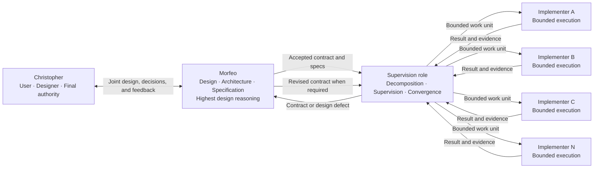

# Aether Agents — Conceptual Multi-Agent Design

**Status:** accepted conceptual baseline through R0
**Accepted:** 2026-08-17
**Product authority:** Christopher

## 1. Purpose and scope

This document owns Aether's current product concept: participants, roles, authority boundaries, selected foundations, and explicitly open technical questions.

It does not define the final process topology, concurrency mechanism, Git strategy, persistence technology, communication protocol, model allocation, deployment, or implementation. Those decisions belong to the stages linked from `ROADMAP.md`.

Aether is deliberately **prompt-native and agentic**. A stage is a cognitive work frame that an agent recognizes or forms from current intent, instructions, context, and relevant artifacts. No workflow engine, parser, scheduler, database, state machine, or executable transition is required to create or advance a design stage.

Future code may provide communication, persistence, observability, tools, objective artifact validation, or enforcement of protected effects. Such code is supporting infrastructure: it does not define product intent, cognitive stages, or the agents' reasoning sequence.

## 2. Product model

Aether separates one human authority and three AI-agent roles:

1. **Christopher designs and decides.**
2. **Morfeo turns intent into coherent design, specifications, and contracts.**
3. **The unnamed supervision role conducts execution against an accepted contract.**
4. **The unnamed implementation role executes bounded units of work and may be replicated as A, B, C...N instances.**

This separation prevents an economical implementation agent from taking product decisions, a supervisor from silently changing design, or Morfeo from spending high-value reasoning on bounded mechanical work that another role can execute.

## 3. Conceptual flow



## 4. Roles and authority

| Role | Primary responsibility | May decide | Must escalate | Primary output |
| --- | --- | --- | --- | --- |
| **Christopher — user and designer** | Own product intent and final technology authority | Vision, objectives, constraints, priorities, preferences, acceptance, and protected external effects | Nothing inside product authority; safety and platform constraints still apply | Current intent and final decisions |
| **Morfeo — design and specification** | Convert Christopher's intent into coherent design and executable contracts | Evidence-backed reversible design defaults within delegated scope | Material ambiguity without a defensible default; conflicts with Christopher's intent; protected effects | Accepted specs and contracts |
| **Morfeo — learning and adaptation** | Improve long-term collaboration with Christopher | Durable memory, preferences, reusable design skills, and context strategy | Any inference that would contradict current instruction or turn temporary state into a permanent preference | Better context and future contracts |
| **Supervision role — unnamed** | Conduct execution until the accepted contract is satisfied or shown defective | Work decomposition, dependencies, parallelism, assignment, retries, evidence review, and operational convergence within the contract | Any need to change product intent, selected technology, authority, or acceptance criteria | Integrated result and evidence, or a structured contract defect |
| **Implementation role — unnamed, replicable** | Execute one bounded work unit correctly | Local implementation choices allowed by the task and contract | Missing authority, contract ambiguity, blockers, or any required redesign | Executed change, evidence, and status or blocker |

Each lower level has a narrower decision space. A lower role must never silently repair a higher-level defect by changing intent.

```text
Implementer
    ↓ blocker or contract defect
Supervision
    ↓ product or design defect
Morfeo
    ↕ Christopher when material authority is required
Revised accepted contract
    ↓
Supervision and implementation resume
```

## 5. Prompt-native operating method

Aether's multi-agent workflow means a pattern of prompts, instructions, contracts, handoffs, and agent reasoning. It is not a deterministic pipeline.

An agent may infer, define, split, combine, revisit, or reorder practical work stages as evidence requires. Roadmap labels and gates are documentary or instructional signals. Tests, checklists, scripts, and validators measure artifacts, implementations, or effects; they do not authorize cognitive stage transitions.

Aether may later automate transport or safeguards. Automation remains subordinate to the agentic method and cannot become the source of product intent.

## 6. Replicable implementation role

The implementation role is one role with multiple possible instances, not a set of personalities or permanently named specialties.

```text
Supervision
    ├── Implementer A
    ├── Implementer B
    ├── Implementer C
    └── Implementer N
```

Replication is intended to accelerate independent or sufficiently decoupled work. R5 and R7 must still determine isolation, synchronization, concurrency limits, evidence independence, failure handling, and integration. The conceptual ability to replicate does not authorize creating workers now.

## 7. Model and reasoning policy

No fixed model hierarchy has been accepted. The earlier idea that Morfeo should always receive the most expensive model, supervision an intermediate model, and implementation the cheapest model is only a hypothesis.

R12 must select models through controlled evaluation by role and gate. Quality and authority requirements come first; cost is optimized only among candidates that pass. Supervision may require reasoning equal to or greater than generation when independent verification, dependency analysis, or drift detection proves harder than producing the original artifact.

## 8. Spec-Driven Development and GitHub Spec Kit

Aether uses Spec-Driven Development: accepted specifications and contracts govern implementation rather than documenting code after the fact.

GitHub Spec Kit is the selected methodological foundation for constitution, specification, clarification, research, planning, tasks, requirements-quality checks, analysis, implementation, and convergence.

Aether will absorb Spec Kit's intellectual contracts before choosing an integration mechanism. The preferred adaptation order is:

```text
methodological reuse
    → Aether prompts, skills, and contracts
    → project-local templates, presets, overlays, or extensions if needed
    → upstream-core changes only for demonstrated incompatibility
```

Spec Kit is not installed or vendored by this design baseline. R3 owns the future mapping of phases across Morfeo, supervision, and implementation.

## 9. Hermes Framework

Hermes Agent / Hermes Framework is the selected agent foundation. Selection does not mean every native mechanism is automatically adopted, nor does it select Hermes Kanban or any other coordination subsystem as Aether's architecture.

R4 must classify relevant Hermes capabilities as reusable, adaptable, insufficient, or incompatible. The foundation may be reopened only by Christopher if R4 produces evidence that a non-negotiable Aether requirement is incompatible with Hermes and no bounded adaptation is responsible. Discovering a missing native capability alone is not sufficient; Aether may extend the framework.

## 10. Communication protocol

A2A is the preferred communication candidate, not an accepted protocol decision. R6 must determine whether it fits Aether's topology, contracts, identity, cancellation, evidence, and security requirements.

R6 must separately decide whether A2A applies to every agent boundary or only boundaries that cross profiles, processes, machines, or frameworks. Aether-specific contract and coordination semantics may remain above the transport protocol.

## 11. Accepted product decisions and review triggers

| ID | Current decision | Reopen when |
| --- | --- | --- |
| **PD-01** | Christopher owns final product and technology authority. | Christopher explicitly changes the authority model. |
| **PD-02** | Aether has Morfeo, one supervision role, and one replicable implementation role in addition to Christopher. | Evidence from R2, R5, or R7 shows the separation cannot preserve authority, quality, or useful execution. |
| **PD-03** | Only Morfeo currently has a proper name; the other roles remain unnamed. | Christopher explicitly names or restructures them. |
| **PD-04** | Lower roles cannot silently change higher-level intent or contracts. | Only a Christopher-approved authority redesign in R1 or R10. |
| **PD-05** | Hermes Framework is the selected agent foundation. | R4 demonstrates a non-negotiable incompatibility with no responsible bounded adaptation, and Christopher chooses to reopen it. |
| **PD-06** | GitHub Spec Kit is the methodological foundation. | Upstream change or R3 evidence shows a core principle conflicts with an accepted Aether requirement and cannot be adapted without weakening either source. |
| **PD-07** | The implementation role is replicable as A...N instances. | R5 or R7 evidence shows replication cannot preserve isolation, authority, integration, or acceptable economics. |
| **PD-08** | Design stages are prompt-native cognitive constructs, not code-instantiated workflow objects. | A later stage demonstrates a specific safety or correctness property that requires bounded executable enforcement; the cognitive method remains authoritative. |
| **PD-09** | Design, build, and activation are separate authority scopes. | Christopher explicitly replaces the scope model after R1 or R10 analysis. |

A current explicit instruction from Christopher always supersedes older project content; the owning artifact must then be updated.

## 12. Open decisions and owners

| Topic | Owning stage |
| --- | --- |
| Christopher–Morfeo interaction, authority matrix, and operational experience | R1 |
| Contract metamodel, handoffs, acceptance, and defect return | R2 |
| Multi-agent mapping of Spec Kit methods | R3 |
| Native Hermes boundary and Aether extensions | R4 |
| Agent topology, identity, process/profile boundary, and isolation | R5 |
| A2A adoption and communication envelope | R6 |
| Supervision, parallelism, retries, and convergence | R7 |
| Git, workspaces, ownership, and integration | R8 |
| Persistence, artifacts, memory, skills, and recovery | R9 |
| Security, trust, and executable authority enforcement | R10 |
| Evidence, observability, and controlled evaluation | R11 |
| Models, routing, budgets, and role-specific quality gates | R12 |
| Coherent design release and implementation-entry contract | R13 |

No open decision in this table is authorized merely because a framework already provides a mechanism.

## 13. Canonical artifact relationships

- `DESIGN.md` owns the current conceptual product design and accepted high-level product decisions.
- `ROADMAP.md` owns only stage boundaries, dependencies, documentary status, and links.
- `specs/<stage>/spec.md` owns current requirements and decisions for one stage.
- `specs/<stage>/research.md` owns evidence, rationale, alternatives, and change impact.
- Plans, contracts, tasks, prompts, code, and runtime state are derived artifacts or implementation evidence.
- Agent prompts, skills, memories, and conversations are operational context, not competing product truth.

## 14. Reference sources

- Hermes Agent / Nous Research: <https://github.com/NousResearch/hermes-agent>
- GitHub Spec Kit: <https://github.com/github/spec-kit>
- Agent2Agent Protocol: <https://github.com/a2aproject/A2A>

The existence of a capability in any reference source does not imply its adoption by Aether.
