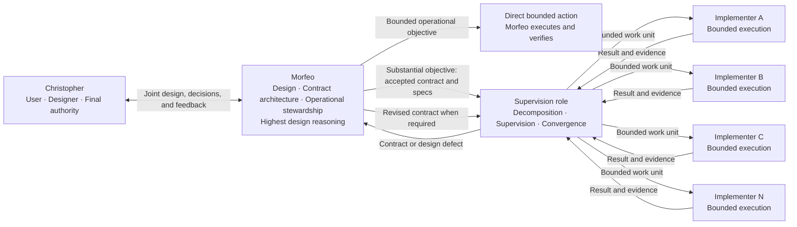

# Aether Agents — Conceptual Multi-Agent Design

**Status:** accepted current conceptual design through PD-76; operational reliability stabilization active
**Accepted baseline:** 2026-08-17
**Last amended:** 2026-08-27
**Product authority:** Christopher

## 1. Purpose and scope

This document owns Aether's current product concept: participants, roles, authority boundaries, selected foundations, and explicitly open technical questions.

It does not define the final process topology, concurrency mechanism, Git strategy, persistence technology, communication protocol, model allocation, deployment, or implementation. Those decisions belong to the stages linked from `ROADMAP.md`.

Aether is deliberately **prompt-native and agentic**. A stage is a cognitive work frame that an agent recognizes or forms from current intent, instructions, context, and relevant artifacts. No workflow engine, parser, scheduler, database, state machine, or executable transition is required to create or advance a design stage.

Future code may provide communication, persistence, observability, tools, objective artifact validation, or enforcement of protected effects. Such code is supporting infrastructure: it does not define product intent, cognitive stages, or the agents' reasoning sequence.

## 2. Product model

### What Aether builds

Aether builds software. The owner states an idea once — "build me a website", a new feature, a change to something that already exists — and the system produces working code that is tested, validated, and well implemented, without further supervision.

Both greenfield and brownfield work are first-class. Aether is used by a working programmer on new projects and on projects that already exist and already run; neither case is the exception.

Aether is not specialized to a stack, a domain, or a project type, and it is not tailored to any individual. It is public and open source, and intended to be usable by any owner. The only personalization is the preferences Morfeo learns about its owner through the Hermes framework, which makes that memory structural rather than convenient: it is the system's single adaptation mechanism.

**Success** is fidelity to intent, achieved without supervision. Aether fails if the agents cannot work alone, or if they work alone and produce something that is not the idea the owner asked for.

**Quality** means the software does what the owner wanted. The specification is the quality mechanism, and Spec Kit's practices are how it earns that role. The corollary is load-bearing: what is obvious to the owner does not exist for the agent, so the job of the specification is to write the obvious down.

### Why the roles are separated

Aether was previously hub-and-spoke: a single Hermes agent permanently designed, delegated, supervised, implemented, held the conversation with the owner, and maintained its own skills. That overload failed. The current role separation corrects a diagnosed failure, not an architectural preference, so **permanent re-concentration remains the standing failure mode**. It is distinct from a bounded operational action performed directly by Morfeo: punctual stewardship does not transfer the Supervisor's or Implementer's standing responsibilities to Morfeo.

The split mirrors a software team: the owner is the product owner, Morfeo is the designer, the supervision role is the tech lead, and the implementation role writes the code. A design decision that would make no sense in a human team is probably wrong.

### Participants

Aether separates one human authority and three AI-agent roles:

1. **Christopher designs and decides.**
2. **Morfeo turns intent into coherent design, specifications, and contracts, and is the owner's direct operational steward for proportional bounded work.**
3. **The unnamed supervision role conducts execution against an accepted contract.**
4. **The unnamed implementation role executes bounded units of work and may be replicated as A, B, C...N instances.**

This separation prevents an economical implementation agent from taking product decisions or a supervisor from silently changing design. It also prevents the opposite inefficiency: waking the full pipeline for bounded operational work that Morfeo can complete confidently without gaining proportionate assurance from decomposition and independent review.

## 3. Conceptual flow



## 4. Roles and authority

| Role | Primary responsibility | May decide | Must escalate | Primary output |
| --- | --- | --- | --- | --- |
| **Christopher — user and designer** | Own product intent and final technology authority | Vision, objectives, constraints, priorities, preferences, acceptance, and protected external effects | Nothing inside product authority; safety and platform constraints still apply | Current intent and final decisions |
| **Morfeo — design and specification** | Convert Christopher's intent into coherent design and executable contracts | Evidence-backed reversible design defaults within delegated scope | Material ambiguity without a defensible default; conflicts with Christopher's intent; protected effects | Accepted specs and contracts |
| **Morfeo — operational stewardship** | Complete bounded operational objectives directly when the full pipeline adds no proportionate guarantee | Route selection for the complete owner objective; local reversible execution choices inside existing authority | A direct action that expands into substantial work; any authority or protected effect not already delegated | Verified direct result, or one executable contract handed to Supervisor |
| **Morfeo — learning and adaptation** | Improve long-term collaboration with Christopher | Durable memory, preferences, reusable design skills, and context strategy | Any inference that would contradict current instruction or turn temporary state into a permanent preference | Better context and future contracts |
| **Supervision role — unnamed** | Conduct execution until the accepted contract is satisfied or shown defective | Work decomposition, dependencies, parallelism, assignment, retries, evidence review, and operational convergence within the contract | Any need to change product intent, selected technology, authority, or acceptance criteria | Integrated result and evidence, or a structured contract defect |
| **Implementation role — unnamed, replicable** | Execute one bounded work unit correctly | Local implementation choices allowed by the task and contract | Missing authority, contract ambiguity, blockers, or any required redesign | Executed change, evidence, and status or blocker |

Each lower level has a narrower decision space. A lower role must never silently repair a higher-level defect by changing intent.

```text
Implementer
    ↓ blocker or contract defect
Supervision
    ↓ product or design defect
Morfeo
    ↕ Christopher when material authority is required
Revised accepted contract
    ↓
Supervision and implementation resume
```

## 5. Prompt-native operating method

Aether's multi-agent workflow means a pattern of prompts, instructions, contracts, handoffs, and agent reasoning. It is not a deterministic pipeline.

Morfeo selects between direct stewardship and the multi-agent pipeline by reasoning about the owner's complete objective. No classifier, score, numeric threshold, workflow state, or external gate makes that decision. A direct route is appropriate when scope is understood and bounded, consequences are inspectable, correction or reversal is reasonably simple, decomposition is unnecessary, and independent review would not add proportionate value. A feature, architectural change, multi-responsibility objective, complex integration, or materially uncertain build belongs to the pipeline.

The unit of classification is the objective the owner requested, not each technical mutation. Morfeo must not split a substantial objective into apparently small steps to execute it directly. Inspection to discover scope is allowed and does not itself select the direct route. If direct inspection reveals substantial work, Morfeo stops expanding the change, produces the canonical contract, and hands it to Supervisor.

The governing rule is: use the process that fits the problem, not the maximum process available.

An agent may infer, define, split, combine, revisit, or reorder practical work stages as evidence requires. Roadmap labels and gates are documentary or instructional signals. Tests, checklists, scripts, and validators measure artifacts, implementations, or effects; they do not authorize cognitive stage transitions.

Aether may later automate transport or safeguards. Automation remains subordinate to the agentic method and cannot become the source of product intent.

## 6. Replicable implementation role

The implementation role is one role with multiple possible instances, not a set of personalities or permanently named specialties.

```text
Supervision
    ├── Implementer A
    ├── Implementer B
    ├── Implementer C
    └── Implementer N
```

Replication is intended to accelerate independent or sufficiently decoupled work. R5 and R7 must still determine isolation, synchronization, concurrency limits, evidence independence, failure handling, and integration. The conceptual ability to replicate does not authorize creating workers now.

## 7. Model and reasoning policy

Aether uses a descending capability-and-cost methodology aligned with the narrowing decision space of each role:

| Role | Capability position | Economic rationale |
|---|---|---|
| Morfeo | Highest-capability selected model | Intent extraction, product decisions, contract architecture, and bounded direct stewardship have the widest error propagation. |
| Supervisor | Strong independent-judgement model | Decomposition, dependency analysis, review, integration, and convergence require judgement independent from both intent authoring and implementation. |
| Implementer | Lowest-cost model that still passes the role's quality gates | Its unit already fixes the goal, context, shared decisions, and acceptance criteria; parallel throughput must not relax correctness. |

The public distribution binds no provider, Router, or model identifier. The installing user chooses the provider and role bindings, may use different vendors, and may select the same model for two or all three roles. Descending allocation is the methodology for choosing among qualified models, not a requirement to buy three distinct services.

Every binding is held to the same contract, project constitution, tests, and review standard. Future re-tiering and claims that one model is superior require controlled evaluation by role and gate under R11 and R12. Model identifiers remain local configuration facts; prompts, work cards, and public product requirements depend on role capability rather than a vendor-specific name.

## 8. Spec-Driven Development and GitHub Spec Kit

Aether uses Spec-Driven Development: accepted specifications and contracts govern implementation rather than documenting code after the fact.

GitHub Spec Kit is the selected methodological foundation for constitution, specification, clarification, research, planning, tasks, requirements-quality checks, analysis, implementation, and convergence.

Aether will absorb Spec Kit's intellectual contracts before choosing an integration mechanism. The preferred adaptation order is:

```text
methodological reuse
    → Aether prompts, skills, and contracts
    → project-local templates, presets, overlays, or extensions if needed
    → upstream-core changes only for demonstrated incompatibility
```

Spec Kit is not installed or vendored by this design baseline. R3 owns the future mapping of phases across Morfeo, supervision, and implementation.

## 9. Hermes Framework

Hermes Agent / Hermes Framework is the selected agent foundation. Selection does not mean every native mechanism is automatically adopted.

Hermes provides **three coordination primitives**, and Aether builds none of them (PD-28):

- **In-process delegation** — a function call that forks anonymous subagents and joins their results. Fast, observable, hierarchical, steerable mid-flight, and not durable across a restart.
- **The durable multi-profile board** — a shared task queue where every worker is a full OS process with its own profile and persistent memory, every handoff is a durable row, work survives crashes by reclaim, humans can intervene at any point, and each task may pin its own model.
- **A2A** — the Agent2Agent protocol v1.0, bidirectional, for crossing process, machine, or framework boundaries.

An earlier version of this section declared the board subsystem not selected. **That declaration is withdrawn**: it was made without evidence, and R4's verified research established that upstream describes the board's purpose in terms that match Aether's architecture directly — decompose, implement in parallel worktrees, review, iterate, open a pull request — and that every criterion upstream gives for choosing it is an accepted Aether requirement. The choice among the three primitives belongs to R5 and must be argued from those criteria.

R4 classifies relevant capabilities as reusable, adaptable, insufficient, incompatible, or unselected. A capability must not be classified as unselected on unverified evidence. The foundation itself may be reopened only by Christopher, and only if a non-negotiable Aether requirement proves incompatible with Hermes with no responsible bounded adaptation; a missing native capability alone is not sufficient.

## 10. Communication protocol

A2A is the preferred communication candidate, and Hermes `0.20.4` — the distribution version in Aether's locked public `v2026.8.18` baseline — **ships a complete bidirectional implementation** as a platform plugin: protocol v1.0, agent cards, JSON-RPC methods, streaming, signed push notifications, per-peer tokens, prompt-injection filtering, credential redaction, an audit log, and anti-loop caps. It interoperates with agents built on other frameworks.

Availability is still not adoption. Upstream's own guidance is that A2A is for crossing process, machine or framework boundaries, and that multiple agents on one machine should prefer in-process delegation or the durable multi-profile work queue.

R6 must therefore decide against that guidance and against Aether's chosen topology, not against availability. The question is which Aether role boundaries genuinely cross a process, and R5 owns that.

*A previous version of this section claimed Hermes contained no A2A implementation. That claim was researched against version 0.19.1, which is not the source Aether runs, and is withdrawn. See `specs/r4-hermes-boundary/research.md` §11.*

## 11. Accepted product decisions and review triggers

| ID | Current decision | Reopen when |
| --- | --- | --- |
| **PD-01** | Christopher owns final product and technology authority. | Christopher explicitly changes the authority model. |
| **PD-02** | Aether has Morfeo, one supervision role, and one replicable implementation role in addition to Christopher. | Evidence from R2, R5, or R7 shows the separation cannot preserve authority, quality, or useful execution. |
| **PD-03** | Only Morfeo currently has a proper name; the other roles remain unnamed. Profile identifiers such as `supervisor` and `implementer` are role descriptors used as runtime names, not proper names. | Christopher explicitly names or restructures them. |
| **PD-04** | Lower roles cannot silently change higher-level intent or contracts. | Only a Christopher-approved authority redesign in R1 or R10. |
| **PD-05** | Hermes Framework is the selected agent foundation. | R4 demonstrates a non-negotiable incompatibility with no responsible bounded adaptation, and Christopher chooses to reopen it. |
| **PD-06** | GitHub Spec Kit is the methodological foundation. | Upstream change or R3 evidence shows a core principle conflicts with an accepted Aether requirement and cannot be adapted without weakening either source. |
| **PD-07** | The implementation role is replicable as A...N instances. | R5 or R7 evidence shows replication cannot preserve isolation, authority, integration, or acceptable economics. |
| **PD-08** | Design stages are prompt-native cognitive constructs, not code-instantiated workflow objects. | A later stage demonstrates a specific safety or correctness property that requires bounded executable enforcement; the cognitive method remains authoritative. |
| **PD-09** | Design, build, and activation are separate authority scopes. | Christopher explicitly replaces the scope model after R1 or R10 analysis. |
| **PD-10** | Aether builds software from a stated intent: tested, validated, working code produced without supervision. | Christopher redefines what the product does. |
| **PD-11** | Greenfield and brownfield work are both first-class. | Christopher restricts the product to one of the two. |
| **PD-12** | Aether is universal and open source; the only personalization is Morfeo's learned owner preferences. | Christopher decides Aether is personal infrastructure rather than a distributable product. |
| **PD-13** | Permanent re-concentration of roles is the standing architectural risk, since the prior hub-and-spoke design failed by role overload. Punctual proportional execution by Morfeo under PD-44 is legitimate stewardship, not reassignment of Supervisor or Implementer as standing responsibilities. | Evidence shows the proportional boundary causes Morfeo to become Aether's general implementer or weakens the three-role separation. |
| **PD-14** | Completed work is reviewed by running the product, not by reading the diff, and review is retrospective. | Christopher changes how he accepts work. |
| **PD-15** | **Aether** maintains the project end to end. The owner operates no part of the repository, toolchain, or release path, and the normal local/reversible path contains no confirmation gate. Pipeline effects are performed by the role that owns the phase; PD-44 additionally permits Morfeo to perform bounded operational work directly without assuming pipeline implementation as a permanent role. Reversibility, tests and independent review carry the normal safety burden; R10 is reserved for the narrow irreversible/external boundary defined by PD-71. | An irreversible failure demonstrates that the narrowed edge boundary is insufficient, or Christopher restores confirmation gates. |
| **PD-16** | Defects noticed outside the requested scope are raised as a question, never fixed or discarded silently. | Christopher delegates in-scope judgement for incidental repairs. |
| **PD-17** | The contract is the Spec Kit artifact set. Aether introduces no competing contract artifact, and carries its own authority, budget, and brownfield boundary inside `plan.md`. | Evidence shows the upstream artifact set cannot carry an Aether obligation without distortion. |
| **PD-18** | Contract defects reach Morfeo and external failures reach the owner. **Resolved by PD-32:** both are raised by blocking the card with a reason, which waits durably instead of interrupting anyone. | — |
| **PD-19** | Aether borrows Spec Kit's intellectual practices and builds its own workflow on top. Upstream is read before anything is designed, only genuine gaps are designed, and every deviation is recorded. | Spec Kit ceases to be maintained or diverges from Spec-Driven Development. |
| **PD-20** | When Morfeo selects the pipeline, the handoff falls between technical planning and task breakdown. Morfeo delivers intent and approach; the supervision role makes it executable and owns breakdown, analysis, review, and convergence. A direct PD-44 action creates no delegated unit or role boundary. | Evidence shows the supervision role cannot derive a breakdown faithful to the contract. |
| **PD-21** | In the pipeline, the supervision role is the independent reviewer that Spec Kit assumes must be human, because it authors neither the requirements nor the code. Direct PD-44 stewardship is selected only when independent review would not add proportionate value; it is not disguised pipeline work. | A separate reviewing capability proves necessary beyond the three roles, or direct-route defects show review cannot remain a proportional judgement. |
| **PD-22** | Owner preferences live in Morfeo's learned memory; a project's standards live in that project's constitution. The two are never merged. | Aether becomes single-user infrastructure rather than a distributable product. |
| **PD-23** | Testing is a per-project standard recorded in that project's constitution, resolved during extraction and never defaulted. Test-first is optional. | Christopher imposes a universal testing rule. |
| **PD-24** | Execution never pauses for the owner between units of work. Each converged increment is independently runnable. A unit blocked on a defect is the exception and does not stop its siblings. | Christopher asks to validate between units. |
| **PD-25** | Hermes already implements most of the multi-agent runtime and structurally enforces several Aether invariants. Where a native capability satisfies a requirement, it is the primary mechanism and Aether's instruction is reinforcement. | A Hermes upgrade removes or weakens an enforced invariant. |
| **PD-26** | **Superseded by PD-29.** Recorded as "unattended execution cannot survive a runtime restart"; that was a property of in-process delegation, not of Hermes. | — |
| **PD-27** | Every agent gets its own profile. Two agent processes MUST NOT share one Hermes home, because both write memory and each loads the other's writes into its prompt. Shared memory, where needed, uses an external memory provider. | Upstream withdraws the constraint. |
| **PD-28** | Hermes provides three coordination primitives — in-process delegation, a durable multi-profile board, and A2A. Aether selects among them on upstream's stated criteria, and builds none of them. | A requirement is found that no primitive satisfies. |
| **PD-29** | Aether's coordination primitive is Hermes's durable multi-profile board. The unit of durability is the card, not the process: a crash or restart costs at most one attempt. Work crossing a role boundary always moves as a card. A direct PD-44 action crosses no role boundary and therefore does not require a ceremonial card. | A requirement is found that the board cannot satisfy and delegation or A2A can. |
| **PD-30** | Three profiles, one per role, matching PD-02 exactly; the Implementer remains replicable and Supervisor remains separate. **Partially superseded by PD-44:** absence of Morfeo's operational tools is no longer the mechanism separating the roles. Parallelism is a concurrency setting, never additional roles or profiles. | Christopher restructures the roles. |
| **PD-35** | Role responsibility is **semantic, not a local security principal**. Morfeo, Supervisor and Implementer run under the same trusted local user; their product responsibilities remain distinct, but ordinary reversible local work is governed by instruction, contract, worktree isolation, evidence and review rather than a hook that tries to encode the organigram. Capability must never be described as authority, and prompt/review boundaries must never be described as structural isolation. | Evidence shows a specific irreversible or external effect needs an additional high-confidence boundary under PD-71. |
| **PD-31** | Implementation work runs in a git worktree per card, so parallel workers never share a working tree. A conflict is resolved by a fresh worker that produced neither side, carrying both intents through parent links — neutrality comes from fresh context, not from a new role. | — |
| **PD-32** | Escalation is a blocked card with a reason. It waits durably, any role or Christopher may act on it, and sibling work is untouched. Non-convergence blocks for review rather than exiting silently. | — |
| **PD-33** | An execution problem is never solved by adding an agent role. Fresh context, a card-pinned skill, or a per-card model override are tried first; a new role requires Christopher's explicit decision against PD-02. | Christopher decides a fourth role is warranted. |
| **PD-34** | `tasks.md` is the breakdown of record and belongs to the contract; cards are execution instances of its units. There is one plan and one execution surface, never two plans. | — |
| **PD-36** | **Escalation is proportional.** Implementer decides reversible technical details locally when they do not change scope, acceptance criteria, a shared interface, another worker's independent work, or product authority. A material question that the contract can answer but affects shared execution goes to Supervisor through the durable board; a question the contract genuinely cannot answer reaches Morfeo, who alone may revise owner intent and ask Christopher. Decision cards remain available for genuine cross-role decisions, but are not mandatory ceremony for local implementation judgement. | Christopher changes who answers a stuck unit, or E2E evidence shows local judgement creates unacceptable cross-unit drift. |
| **PD-37** | **The human-visible block budget is effectively one attempt per unit.** After one block, one release, and a second block for the same cause, the runtime routes the unit out of the work pool. The threshold is a source constant, absent from configuration, and raising it would mean modifying upstream core. Aether designs so this budget is rarely spent. | Upstream makes the threshold configurable. |
| **PD-38** | **A native behaviour that performs a phase Aether assigned to a role is incompatible and is disabled, not tolerated.** Automatic triage decomposition and automatic triage specification are both on by default and both do the supervisor's work without reading the contract. Availability is not adoption, and a default is not a decision. | The supervisor role is removed or upstream removes the behaviours. |
| **PD-39** | **Artifact ownership is an accountability rule, not a micro-permission system.** Morfeo owns owner intent and final contract revisions; Supervisor owns pipeline decomposition and integration judgement; Implementers own the code produced by their units. Worktrees, Git history and review preserve attribution. A role may inspect any project artifact needed as evidence, and ordinary local file access is not blocked merely because another role owns the decision represented there; unauthorized semantic changes are rejected in review or reverted. | Evidence shows review/reversibility cannot preserve a specific artifact boundary and the missing guarantee qualifies as a protected edge effect under PD-71. |
| **PD-40** | **The board is the only inter-role transport.** A2A is implemented as a platform adapter, is complete, and is deliberately unused while every role runs on one host; MCP is an outward integration surface and never a work transport. | A role must run on another machine, or a non-Hermes agent must participate as a role. |
| **PD-42** | **Recovery is not free.** A crashed worker's unit survives, but the crash consumes an attempt *and* increments the failure counter, while a stale-claim reclaim does not. Environmental failure and defective work draw on the same budget, so the attempt limit must exceed the number of environmental failures one unattended session can plausibly produce. Verified by execution. | Upstream separates environmental failure from work failure. |
| **PD-43** | **Enforcement can be fully configured and completely inert.** A hook that is not on the runtime's first-use allowlist does not fire at all — it does not fail closed, it is absent. Dispatcher-spawned workers are immune because the dispatcher accepts hooks explicitly when spawning; **Morfeo is the exposed role**, because it runs as a persistent interactive session. Enforcement must be verified as live, never assumed from configuration. This runtime fact does not require a hook that restricts Morfeo to contract-file writes; PD-44 removes that conceptual dependency. | Upstream removes the consent gate or applies it differently to persistent sessions. |
| **PD-44** | **Morfeo executes proportionally.** Morfeo is the owner's interlocutor, contract architect, and operational steward. It may use terminal and general project file access to complete a bounded objective directly when the full pipeline adds no proportionate guarantee. It chooses agentically against the complete owner objective: no classifier, score, numeric threshold, special workflow, or external gate selects the route. It must not fragment substantial product work into small mutations, and if inspection reveals feature-scale, architectural, multi-responsibility, or materially uncertain product work, it stops expansion and hands one executable contract to Supervisor. **Recovery is the explicit exception:** when Aether/Hermes itself prevents the requested route from functioning, Morfeo restores the last known-good E2E by retry/resume, rollback, or at most a minimal focused repair; it does not create an Objective Contract or use the broken pipeline to repair that pipeline, and hardening becomes a separate objective after recovery. Git rollback is preferred when appropriate. **Amended 2026-08-20:** Morfeo also receives `code_execution`, `cronjob`, and `delegation` (`delegate_task`) on both CLI and Telegram; browser execution and computer use remain excluded. Cron and delegated subagents remain bounded by the owner's requested objective; delegation assists Morfeo's own bounded work and is not a bypass around the three-role product pipeline. | Evidence shows proportional routing or bounded recovery causes Morfeo to become the standing general implementer, or Christopher changes Morfeo's stewardship authority. |
| **PD-45** | **`skills` and `vision` are base toolsets for Morfeo, Supervisor, and Implementer.** Every role may manage skill documents for continuous self-improvement and inspect images or frontends within work it is already authorized to perform. Tool access does not widen any role's decision authority or responsibility boundary. | Evidence shows `skills` or `vision` access produced an unforeseen effect that requires containment, or Christopher restricts either capability to fewer roles. |
| **PD-46** | **Capability and cost descend with role scope without binding the public product to a provider.** The installer selects the strongest qualified model for Morfeo, a strong independent-judgement model for Supervisor, and the lowest-cost model that still passes the Implementer gates. The same model may serve multiple roles, and every tier retains the same contract, tests, and review standard. Provider, Router, and model identifiers are private installation facts and never public product requirements. | Christopher changes the methodology, or controlled role-and-gate evaluation demonstrates a materially better allocation. |
| **PD-47** | **The initial pipeline capacity is one Supervisor and three concurrent Implementers.** One Supervisor owns decomposition, review, and integration for a contract; speed comes from independent Implementer instances, not duplicate Supervisors. The board-wide cap remains four, with explicit profile limits `supervisor: 1` and `implementer: 3`. | Measured collision rate, integration cost, provider throttling, resource saturation, or contract duration justify recalibration. |
| **PD-48** | **Aether 1.0 is a public stable product release, not a design snapshot.** A third party must be able to install and update it, supply their own credentials, and reproduce the supported three-role product. The public artifact contains only product-owned identities, portable configuration, policy and hooks, Aether-specific skills, lifecycle commands, documentation, and tests. It excludes Christopher's private profiles, Router and model bindings, credentials and authentication, memories, sessions, preferences, personal skill catalog, logs, databases, caches, and machine-specific configuration. | Christopher changes the release promise or evidence shows a narrower public product is the only responsible scope. |
| **PD-49** | **Aether qualifies and ships against an exact public Hermes source, upstream by default.** Every Aether release selects `upstream` or `transitional_fork`, pins the exact public repository, tag, commit, source/artifact digest, Python compatibility, and Aether compatibility, and installs the original `hermes-agent` distribution in isolation without replacing a user's personal Hermes installation. `transitional_fork` is permitted only under PD-65 while an indispensable patch lacks a qualified upstream replacement. Mutable upstream `main` and automatic source adoption are forbidden. | A public distribution channel cannot preserve the accepted reproducibility and provenance guarantees, or Christopher changes the runtime-source policy. |
| **PD-50** | **Aether 1.0 officially supports Linux native and WSL2 only.** Windows-native and macOS operation are outside the 1.0 support contract. WSL2 support requires a Linux distribution with `systemd`, Linux-side Git and tooling, and both repositories and Hermes state on the Linux filesystem rather than `/mnt/c`. The release matrix uses Ubuntu 24.04 LTS native, Ubuntu 24.04 LTS on WSL2, and continued Garuda/Arch validation. | Christopher changes the platform scope, or qualified evidence supports another platform or requires narrowing an existing one. |
| **PD-51** | **Aether 1.0 has a product release test standard distinct from each downstream project's constitution.** The release cannot be tagged until deterministic CI, clean installation, one real complete Morfeo → Supervisor → Implementer → independent review → integration flow, state-preserving update, rollback, uninstall, secret scanning, and the accepted native-Linux and WSL2 platform checks all pass against the exact release candidate. | Christopher changes the release evidence standard, or a test is shown not to exercise the guarantee it claims. |
| **PD-52** | **Aether is initialized per project.** From a greenfield or brownfield Git repository, `aether init` creates or validates that project's constitution, contract surface, board, workspace isolation, and Git integration; subsequent `aether` launches Morfeo in that project. Each project has its own board and execution state, and no project silently shares cards or workspaces with another. | Evidence shows Hermes's project/board isolation cannot support this mapping, or Christopher chooses a machine-global work queue. |
| **PD-53 — partially superseded by PD-68** | **Issue #192 remains a non-blocking known limitation for Aether 1.0 and targets a future minor release. The former classification of #195 as non-blocking is superseded: #195 is now a 1.0 release prerequisite under PD-68.** Version 1.0 does not claim semantically exact retry accounting, and heartbeat never proves useful-work progress. Both limitations remain public and must not be hidden by release language or UI. | #192 is shown to threaten correctness, authority, recovery, or accepted release evidence; PD-68 owns every reopening condition for #195. |
| **PD-54** | **A packaged CLI is Aether's canonical public distribution and operating surface.** The package installs the `aether` command and owns setup, per-project initialization, launch, diagnosis, update, rollback, and uninstall while keeping Aether source and dependency locks auditable. A repository clone may remain a development path, but it is not the normal user installation. | Packaging proves materially less reliable or maintainable than a tagged-source installer, or Christopher changes the desired product experience. |
| **PD-55** | **Aether updates are explicit, compatible, and recoverable.** Only `aether update` updates the product; it previews current and target versions, creates a backup, updates the CLI, locked Hermes runtime, profiles, and policy as one compatible set, verifies the result, and restores the previous set if verification fails. Aether never performs a silent product update or automatic upstream adoption. | Christopher authorizes unattended updates, or evidence requires a different atomicity or rollback mechanism. |
| **PD-56** | **Aether follows Semantic Versioning and qualifies prereleases before stable publication.** The 1.0 path includes at least one `v1.0.0-rc.N` release candidate, public installation and accepted release evidence against that exact candidate, and only then `v1.0.0`. Release automation must understand SemVer prereleases and must never present an RC as stable. | Christopher changes the versioning policy or a release channel requires a compatible additional representation. |
| **PD-57** | **The public Python distribution is `aether-agents`, its executable is `aether`, and PyPI is the canonical package index.** The normal installation is `uv tool install aether-agents`; releases publish both wheel and source distribution from GitHub Actions through PyPI Trusted Publishing with OIDC, no long-lived PyPI token. Git tags use SemVer (`v1.0.0-rc.1`) and Python metadata uses the equivalent PEP 440 form (`1.0.0rc1`). | The package name becomes unavailable, PyPI or uv cannot preserve an accepted guarantee, or Christopher changes the distribution channel. |
| **PD-58** | **Setup has one validation engine and two supported interfaces.** `aether setup` is the guided human path; `aether setup --config <file>` is the reproducible automation path. Both produce and verify the same state. Secrets are never accepted as command-line arguments or stored in versioned setup files; provider authentication remains in native Hermes credential mechanisms or user-supplied environment state. | Evidence shows one interface cannot preserve parity or a supported deployment requires another non-secret input mechanism. |
| **PD-59** | **Aether's public repository is also a portfolio-quality product surface.** It provides a product-oriented README, executable quickstart, architecture diagram, short real-flow demonstration, published GitHub Pages documentation, Linux/WSL2 support matrix, visible known limitations, release artifacts with checksums and provenance, and reciprocal links among GitHub, documentation, and PyPI. Presentation must demonstrate verified behaviour and never substitute polish for release evidence. | Christopher changes the public presentation goal or a medium cannot be maintained without weakening product work. |
| **PD-60** | **Aether 1.0 adds no product telemetry.** Logs remain local and redact sensitive content; Aether never uploads projects, prompts, contracts, credentials, or usage metrics. Public support uses GitHub Issues for defects and features, GitHub Discussions for questions, and private vulnerability reporting for security disclosures, with no implied response-time SLA. | Christopher explicitly authorizes bounded telemetry or changes the support model after a privacy and threat review. |
| **PD-61** | **Hermes delivery is source-mode aware and never a renamed PyPI package.** In `upstream` mode Aether verifies a source archive for the locked stable upstream tag and commit, builds the original `hermes-agent` distribution in a controlled environment, and installs it into the isolated runtime. In `transitional_fork` mode the public fork builds and publishes the original wheel and source archive with checksums and provenance. The release lock and setup verifier enforce the selected mode before activation. | Upstream publishes an equally verifiable original-package artifact, or another public delivery method better preserves reproducibility and provenance. |
| **PD-62** | **Aether follows the Linux XDG boundary.** Non-secret configuration lives under `~/.config/aether`; versioned runtimes and profiles under `~/.local/share/aether`; local state, logs, and backups under `~/.local/state/aether`; replaceable downloads under `~/.cache/aether`. Project repositories contain only portable project identity and contract artifacts. Boards, credentials, runtime state, and workspaces are local and remain outside tracked project content. | A supported Linux/WSL2 environment cannot provide the XDG mapping or Hermes requires a different isolation boundary. |
| **PD-63** | **External package-manager upgrades are detectable but not silently trusted.** `aether update` is the only supported coherent product update. If `uv tool upgrade aether-agents` or another external action changes the manager independently, `aether doctor` detects the CLI/runtime/profile/lock mismatch, refuses incompatible activation, and offers explicit reconciliation or rollback. Aether does not claim it can prevent the user from changing their own installation. | uv supplies an enforceable atomic multi-artifact update primitive, or evidence requires a different mismatch-recovery contract. |
| **PD-64** | **Release qualification uses the public path selected by the release lock.** The preregistered 1.0 release-candidate scenario installs Aether from PyPI, consumes the exact verified public Hermes source or artifact for its declared `upstream` or `transitional_fork` mode, uses a public Hermes-supported provider rather than private owner infrastructure, and runs a realistic Git repository through the complete three-role path on the accepted native-Linux and WSL2 matrix. Credentials and any model spend require explicit owner authorization at the execution gate and never enter release artifacts. | Christopher changes the qualification path, or the selected public provider cannot exercise an accepted guarantee. |
| **PD-65** | **The Hermes fork is a transition mechanism, not Aether's permanent runtime boundary.** Aether targets a qualified stable upstream Hermes tag and commit and MUST NOT add a new product capability that requires a downstream-only core change. Existing indispensable patches may keep a release temporarily on the public fork only when their Aether guarantee, upstream disposition, qualification evidence, and retirement condition are explicit. Generally useful gaps are proposed upstream; merged equivalents or public upstream extension surfaces replace downstream patches after parity qualification. The steady-state product consumes upstream Hermes through public interfaces, configuration, profiles, skills, and plugins. | Christopher explicitly accepts a permanent downstream product, or verified upstream limitations make an accepted Aether guarantee impossible without one and the maintenance trade-off is reapproved. |
| **PD-66** | **A guard is acceptable only when it is smaller than the failure surface it removes.** Every protected edge effect has positive and negative controls, and ordinary local/reversible work must complete without guard-caused recovery. Unknown ordinary tool use is allowed; only malformed hook invocation or a high-confidence candidate for an enumerated protected edge effect fails closed. Three material false-positive categories already occurred, so the previous micro-permission design is retired rather than patched further. | A concrete irreversible/external incident demonstrates that the minimal boundary omits a necessary high-confidence protected effect. |
| **PD-67 — superseded by PD-71** | The previous design required board/run/assignee/worktree/branch/absolute-path verification inside the pre-tool hook before Morfeo could perform structured contract writes. That local micro-authorization boundary is retired because it produced unacceptable interruption while running inside the same trusted local-user boundary. Contract authority remains semantic and attributable through project identity, Git history and review; protected external/irreversible effects remain governed by PD-71. | Only reopen the retired mechanism if a reproduced irreversible incident cannot be prevented by the narrower PD-71 boundary. |
| **PD-68** | **Aether 1.0 includes local full-lifecycle contract observation before stable release.** A native in-process product plugin records allowlisted metadata from public Hermes hooks and native stores, with optional bounded semantic checkpoints emitted only as fail-open side effects of already-authoritative Aether actions; no role performs an observation step. It follows the owner's originating message through Morfeo contract creation, Supervisor handoff, the causally bound implementation/review graph, acceptance verification, and terminal resolution. It reduces those facts deterministically into duration, participant/action, exact observed tool use, work/run/review/acceptance, ordered semantic steps, parallel deployment waves, execution/rework rounds, sampled dispatch pressure, critical-path/acceleration evidence, flow, separated runtime states, and explicit coverage. Configuration/tool/model evidence is field-covered: model/provider and project-keyed prompt fingerprints are exact when the request hook exposes them; configured toolsets are not conflated with the final effective direct/deferred surface; granted/never-used inventory is claimed only from a demonstrably complete snapshot; schema tokens are labeled estimated unless exact provider serialization/tokenization exists; unavailable context events remain unavailable rather than inferred. Bottleneck and defect attribution always carries native, deterministic, declared, Morfeo-judgment, or undeclared provenance and never becomes a productivity score, worker ranking, or automatic recommendation. Observation history is retained indefinitely with UTC/local-offset dates, producer ordering, indexing, and lossless compaction; deletion occurs only through the explicit owner purge contract. For 1.0, `aether observe` is the sole read surface and presents one coherent, high-quality review brief; the separate read-only agent query tool and dashboard are deferred. `blocked`, `review`, crash, timeout, reclaim, and retry are recoverable facts. Settled mechanical state without authoritative final verification is `completion_candidate`, never fabricated `completed`; cancellation, abandonment, and failure remain distinct. The projection never replaces Kanban, SessionDB, canonical artifacts, Morfeo verification, or owner authority; it stores no raw content or chain-of-thought, makes no outbound/non-loopback request, and may not block legitimate work when degraded. The 1.0 baseline targets public Hermes `v2026.8.18` (`e624e9fde561e1add9388384012b295fde669ade`) without a downstream core patch; generic missing signals may be proposed upstream and adopted only through a qualified later release. Issue `#195` is therefore a 1.0 release prerequisite rather than a future-minor limitation. This decision supersedes PD-53 only for `#195` and narrows PD-60's “no product telemetry” rule to no remote telemetry/analytics or raw-content capture; the bounded local observer is governed by `specs/002-aether-contract-observation/`. | Christopher removes the pre-1.0 requirement, narrows the approved lifecycle boundary, or measured implementation evidence requires an owner-approved revision to the observer contract. |
| **PD-69** | **Aether uses one modular monorepo, one `aether-agents` distribution, and one product version; the same immutable wheel is installed into two isolated environments.** The `uv tool` environment owns the public `aether` manager CLI; the versioned runtime installs the same staged wheel beside Hermes and materializes only `aether_agents.observation.capture.hermes_plugin` through the public `hermes_agent.plugins` entry point. Manager modules never import Hermes; the adapter never imports manager commands/transitions/release/service/auth; both reuse only Hermes-independent observation contracts/code. The release lock binds distribution name, normalized version, pre-build identity, and entry-point target without a circular self-digest. External release provenance and the local transition record bind the staged wheel filename/SHA-256, and qualification proves both installations came from that one artifact. No second package, repository, service, or editable per-profile plugin copy exists. Normative schemas retain one editable source and the bytes in wheel/sdist must be identical. | Christopher deliberately separates manager and observer releases, or two-environment qualification demonstrates a real conflict that cannot preserve the import boundary; any fallback requires contract revision before adoption. |
| **PD-70** | **Contract observation is project-resolved, source-immutable, version-evolvable, and off the agent's durability path.** One verified `ObservationContextResolver` selects the canonical project UUID from exact task/board, session-project, or manager-launch bindings and never from path/profile/time heuristics. Owner messages are bounded candidates until an authoritative contract/root materializes a trace; ambiguity yields null origin timing and no automatic merge. Producer/event identities are restart-safe and reconciliation-idempotent; a writer-lifetime POSIX advisory lock per producer epoch makes an abandoned active segment conservatively coverage-incomplete even with no visible sequence gap. Reducers never append to journals; released JSONL is never migrated; pure upcasters, versioned projections, and preserved unknown-newer bytes make update/rollback/re-update safe. Hook callbacks perform one bounded append but no `fsync`, SQLite, compaction, reconciliation, or migration. Content-derived configuration fingerprints are project-keyed HMAC-SHA-256 epochs; only private recovery/protected export may carry keys. Closed segments compact only through verified deterministic gzip/manifest atomic replacement. During PD-71 stabilization, observation may remain enabled only as fail-open evidence and is not allowed to gate the functional E2E result. | Christopher changes the non-intrusion/privacy/retention trade-off, or the clean-checkout spike demonstrates that a closed requirement is infeasible; implementation may not silently weaken these boundaries. |
| **PD-71** | **Operational safety is reversibility-first and edge-enforced.** Accepted 2026-08-26 after repeated E2E failures and false-positive guard corrections. Work inside an authorized local repository/worktree is presumed reversible and is governed by scope, Git, tests, review and rollback rather than role micro-permissions. The pre-tool hook is limited to high-confidence secrets/credentials, credential acquisition or widening, unauthorized remote publication/deploy/external mutation, clearly destructive irreversible operations, and structurally provable isolation escape. It must not query Kanban/SQLite/Git to authorize ordinary local edits, parse shell text to infer role ownership, enforce decision-card shape, or choose direct versus pipeline routing. | A reproduced material incident shows a missing edge effect that cannot be handled by isolation, review or rollback. |
| **PD-72** | **Aether recovery is rollback-first and bounded.** When Aether/Hermes itself prevents the requested route, Morfeo temporarily acts as recovery steward: retry/resume when safe, otherwise restore the last known-good E2E, otherwise make at most two focused repairs. Recovery creates no Objective Contract, does not dispatch through the broken pipeline, introduces no new feature/spec/upstream patch, and stops immediately when the canary passes. Root-cause hardening is a separate later objective. | Recovery repeatedly fails to restore a known-good baseline without a broader mechanism, or Christopher changes the incident policy. |
| **PD-73** | **Local technical judgement belongs at the lowest responsible role.** Implementer decides reversible implementation details that do not change scope, acceptance, shared interfaces, another unit, or product authority. Supervisor may perform small integration repairs—conflicts, imports, wiring, build/config glue—when they introduce no new behavior. Material product/contract/interface decisions still escalate. These boundaries are evaluated by review and E2E evidence, not pre-tool denial. | E2E evidence shows material drift or integration defects that cannot be contained by review and worktree isolation. |
| **PD-74** | **Reliability freezes feature expansion.** Until the rolling reliability gate reaches at least 19/20 representative E2E passes with the last 10 consecutive, zero guard-caused manual recovery and zero protected-edge violations, new Aether features, Hermes upgrades, nonessential downstream patches and expansion of observation are frozen. Every infrastructure change runs the small canary before another infrastructure change is attempted. | The reliability gate passes, or Christopher explicitly authorizes an exception with known impact. |
| **PD-75** | **Aether's disposable qualification laboratory is a first-class evidence capability, not a second runtime.** Canonical code lives in the Hermes-free `aether_agents.lab` package; scenarios, schemas, fixtures, and operator documentation live under `lab/`; historical `scripts/e2e` entry points remain thin compatibility wrappers. Independent roots may run with a hard concurrency cap of two, while persistent/shared-session lanes remain serial. Morfeo-lab evaluates real isolated runtime behaviour and may diagnose through curated tools, but it never edits Aether or shares product state. Evidence is schema-bound, bounded, redacted, and never promotes deterministic preparation or the separate observation suite into the PD-74 rolling gate. A native persistent-session capability wall is reported honestly and never repaired with a notifier substitute. | Christopher withdraws the formal-laboratory role, or controlled evidence shows this boundary duplicates product runtime, leaks private state, or weakens the release gate. |
| **PD-76** | **The Objective Contract bounds every delegated gate, and historical failure evidence does not veto a corrected candidate unless the contract preregisters that cardinality.** Supervisor and reviewers may add implementation/review units, but may not silently strengthen scope, authority, acceptance, retry, or run-count rules. A failed scenario remains durable evidence; when the contract authorizes bounded correction and same-route rerun, a reviewed corrected PASS may satisfy that scenario without erasing the failed attempt. If decomposition, metadata remediation, or review ceremony becomes the work, Morfeo may stop it, record the alignment defect, and perform the smallest reversible integration/recovery needed to restore the contract path. This is punctual stewardship under PD-44/PD-72, not permanent role re-concentration. | Christopher assigns child-created gates authority equal to the canonical contract, or evidence shows proportional recovery weakens independent review or product fidelity. |
| **PD-77** | **Conversation continuity is flow-bound, not process-bound.** Morfeo retains the owner-facing origin session. One Objective Contract flow binds one exact Supervisor session and one canonical Supervisor workspace across decomposition, review, and integration; each Implementer card receives a fresh session and isolated worktree. The binding is opt-in side data keyed by board, Project, opaque flow id, and profile, protected by lease/generation fencing. Internal milestones do not return to the owner; only explicit `input`, `revision`, or `flow_terminal` events do. | Upstream provides an equivalent qualified primitive, or controlled evidence shows one-workspace Supervisor continuity weakens isolation or integration correctness. |
| **PD-41** | **Every claim about runtime behaviour is labelled verified or assumed.** Executing the behaviour outranks reading the code, which outranks reading the documentation; where they disagree, the more direct evidence wins and the disagreement is recorded. This project has paid twice for treating documentation as evidence. | — |
A current explicit instruction from Christopher always supersedes older project content; the owning artifact must then be updated.

## 12. Design areas and owners

Every area below now has a written specification. The table records which artifact owns each question, not which questions remain open; what remains open within a stage is listed in that stage's `Done When` and in `specs/r13-synthesis-and-release/spec.md` §7.


| Topic | Owning stage |
| --- | --- |
| Christopher–Morfeo interaction, authority matrix, and operational experience | R1 |
| Contract metamodel, handoffs, acceptance, and defect return | R2 |
| Multi-agent mapping of Spec Kit methods | R3 |
| Native Hermes boundary and Aether extensions | R4 |
| Agent topology, identity, process/profile boundary, and isolation | R5 |
| A2A adoption and communication envelope | R6 |
| Supervision, parallelism, retries, and convergence | R7 |
| Git, workspaces, ownership, and integration | R8 |
| Persistence, artifacts, memory, skills, and recovery | R9 |
| Security, trust, and executable authority enforcement | R10 |
| Evidence, observability, and controlled evaluation | R11 |
| Models, routing, budgets, and role-specific quality gates | R12 |
| Coherent design release and implementation-entry contract | R13 |

No open decision in this table is authorized merely because a framework already provides a mechanism.

## 13. Canonical artifact relationships

Aether assigns ownership by semantic question, not by a single linear document hierarchy. Each normative question has one owner below; another artifact may quote, link, or derive from it, but may not become a competing source of truth. The [authority map](docs/authority.md) explains these boundaries for readers without creating another normative owner.

| Semantic information class | Owner or status | Boundary and placement rule |
| --- | --- | --- |
| Current owner instruction and immediate direction | Current explicit owner instruction | Governs immediately, subject to safety and protected-effect limits; capture it in the artifact that owns the question before closure. Objective-specific delegated authority is owned durably by the finalized Objective Contract. It is not durable project history until recorded. |
| Project constitution and governance principles | Accepted `specs/r0-design-governance/spec.md` | Owns project-wide principles. A future `.specify/memory/constitution.md` is a derived materialization, not a second authority; it does not own stage or objective requirements. |
| Framework-wide conceptual product design and accepted high-level decisions | `DESIGN.md` | Owns the product concept and fixed framework decisions; it does not own named-stage requirements, execution plans, current status, or runtime state. |
| Framework role definitions and authority boundaries | `DESIGN.md` | Stage specifications may state only stage-scoped role requirements; versioned role prompts cannot redefine the framework roles or their authority. |
| Named-stage scope, requirements (including stage-scoped role requirements), acceptance, and decisions | `specs/<stage>/spec.md` | Owns the current normative content of that stage; it does not own research history or implementation facts. |
| Stage rationale, decision evidence, alternatives, and change impact | `specs/<stage>/research.md` | Owns the stage's rationale and history as evidence; it never replaces current normative intent in `spec.md`. |
| One objective's executable outcome, scope, delegated authority, deliverables, acceptance, testing, and stop conditions | Finalized `.aether/objective-contracts/<contract-id>/v<N>.md` | Owns one objective's executable binding while remaining constrained by constitution, conceptual design, and applicable stage specifications. Drafts and handoff envelopes do not widen it. |
| Execution approach and interface handoffs | Derived: `plan.md` and stage `contracts/` | Constrained by accepted specifications and applicable Objective Contracts; cannot widen product intent or delegated authority. |
| Delegated work-unit scope and ordering | Derived: task body and `tasks.md` | A task body describes one bounded delegated unit; these artifacts cannot redefine requirements, architecture, or authority. Board run state belongs to the execution record below. |
| Delegated execution coordination and status | Native board rows, events, comments, and runs | This is the durable pipeline record; it does not own product intent, acceptance meaning, or implementation status outside the execution record. |
| Worktree and workspace state | Local isolation (not an authority) | A worktree is mutable write isolation, not an intent or status store; source overlap is reconciled by the integration process. |
| Executable role-local prompt wording | Versioned `SOUL` resources | Owns prompt wording for a role only; it is derived operational context and cannot redefine role responsibility, authority, or project decisions. |
| Private user context and durable preferences/recall | Private `USER`/`MEMORY` | Local/private only; it never owns project principles or decisions and its contents are never placed in public artifacts. |
| Reusable procedure | Versioned skills | Owns reusable method only; it does not own project intent, execution status, or role authority. |
| Checkout and repository operating instructions | `AGENTS.md` | Owns repository-local operating guidance; it does not duplicate or override product and stage truth. |
| Current-build behavior and use guidance | `docs/` | Describes behavior available in the current build and how to use or diagnose it; it does not own conceptual design, normative requirements, or live runtime state. |
| Current implementation status and traceability | `docs/capabilities.toml` | Sole current implementation-status registry. Its generated capability reference is derived and neither artifact is design or behavioral authority. |
| Future and planned work, stage planning, and issue tracking | `ROADMAP.md` and issue records | Owns future/planned work and issue history; it does not serve as the current capability-status registry or current product manual. |
| Release history and deltas | `CHANGELOG.md` and release records | Owns what changed in a release; it does not replace the current manual or current implementation-status registry. |
| Auditable change and verification history | Evidentiary: Git, pull requests, tests, and evidence artifacts | These records support claims about changes and verification; they do not redefine intent. |
| Portable project identity | `.aether/project.toml` | Owns tracked, portable project identity only; it contains no machine-specific runtime mapping or credential material. |
| Implemented behavior and reproducible runtime facts | Evidentiary: source and direct execution | These reveal what is implemented or observed and may expose drift, but cannot redefine normative intent. |
| Project mappings, profile homes, XDG state, configured services/providers, sessions, and private effective runtime observations | Local/private environment and runtime state | Remains outside public artifacts. Public documentation may describe the class and its boundary, never its contents, identifiers, credentials, bindings, machine paths, or live-runtime claims. |
| Reader-facing placement and conflict explanation | Derived: `docs/authority.md` | Explains this section for readers and must not compete with the owners above. `docs/index.md` is navigation only and owns no semantic project truth. |

Conflict handling follows the semantic owner rather than file order or recency alone:

1. Apply the current explicit owner instruction immediately, subject to safety and protected-effect limits.
2. Identify the semantic question and the one artifact that owns it; update that owner first and preserve its rationale or evidence.
3. Reconcile only dependent derived artifacts, including plans, contracts, tasks, prompts, documentation, and implementation outputs; preserve Git, test, evidence, and release history.
4. Do not resolve a disagreement by promoting a task, worktree, prompt, source fact, runtime observation, or framework-provided mechanism into authority.
5. If two accepted normative owners are irreconcilable, or resolution would define mission, capabilities, autonomy, or use cases, stop for the owner/Morfeo decision rather than guessing.

This taxonomy defines no mission, product capability, autonomy envelope, use case, role behavior, or current capability status; it only identifies where such questions would be owned or recorded.

## 14. Reference sources

- Hermes Agent / Nous Research: <https://github.com/NousResearch/hermes-agent>
- GitHub Spec Kit: <https://github.com/github/spec-kit>
- Agent2Agent Protocol: <https://github.com/a2aproject/A2A>

The existence of a capability in any reference source does not imply its adoption by Aether.
