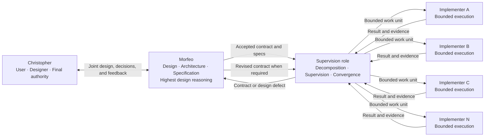

# Aether Agents — Conceptual Multi-Agent Design

**Status:** accepted conceptual baseline through R0
**Accepted:** 2026-08-17
**Product authority:** Christopher

## 1. Purpose and scope

This document owns Aether's current product concept: participants, roles, authority boundaries, selected foundations, and explicitly open technical questions.

It does not define the final process topology, concurrency mechanism, Git strategy, persistence technology, communication protocol, model allocation, deployment, or implementation. Those decisions belong to the stages linked from `ROADMAP.md`.

Aether is deliberately **prompt-native and agentic**. A stage is a cognitive work frame that an agent recognizes or forms from current intent, instructions, context, and relevant artifacts. No workflow engine, parser, scheduler, database, state machine, or executable transition is required to create or advance a design stage.

Future code may provide communication, persistence, observability, tools, objective artifact validation, or enforcement of protected effects. Such code is supporting infrastructure: it does not define product intent, cognitive stages, or the agents' reasoning sequence.

## 2. Product model

### What Aether builds

Aether builds software. The owner states an idea once — "build me a website", a new feature, a change to something that already exists — and the system produces working code that is tested, validated, and well implemented, without further supervision.

Both greenfield and brownfield work are first-class. Aether is used by a working programmer on new projects and on projects that already exist and already run; neither case is the exception.

Aether is not specialized to a stack, a domain, or a project type, and it is not tailored to any individual. It is public and open source, and intended to be usable by any owner. The only personalization is the preferences Morfeo learns about its owner through the Hermes framework, which makes that memory structural rather than convenient: it is the system's single adaptation mechanism.

**Success** is fidelity to intent, achieved without supervision. Aether fails if the agents cannot work alone, or if they work alone and produce something that is not the idea the owner asked for.

**Quality** means the software does what the owner wanted. The specification is the quality mechanism, and Spec Kit's practices are how it earns that role. The corollary is load-bearing: what is obvious to the owner does not exist for the agent, so the job of the specification is to write the obvious down.

### Why the roles are separated

Aether was previously hub-and-spoke: a single Hermes agent designed, delegated, held the conversation with the owner, and maintained its own skills. One agent holding four jobs did all four badly. The current separation is the correction of a diagnosed failure, not an architectural preference — and it follows that **re-concentration is the standing failure mode**. Any later stage in which one role absorbs a neighbouring role's responsibility is rebuilding the architecture that was abandoned.

The split mirrors a software team: the owner is the product owner, Morfeo is the designer, the supervision role is the tech lead, and the implementation role writes the code. A design decision that would make no sense in a human team is probably wrong.

### Participants

Aether separates one human authority and three AI-agent roles:

1. **Christopher designs and decides.**
2. **Morfeo turns intent into coherent design, specifications, and contracts.**
3. **The unnamed supervision role conducts execution against an accepted contract.**
4. **The unnamed implementation role executes bounded units of work and may be replicated as A, B, C...N instances.**

This separation prevents an economical implementation agent from taking product decisions, a supervisor from silently changing design, or Morfeo from spending high-value reasoning on bounded mechanical work that another role can execute.

## 3. Conceptual flow



## 4. Roles and authority

| Role | Primary responsibility | May decide | Must escalate | Primary output |
| --- | --- | --- | --- | --- |
| **Christopher — user and designer** | Own product intent and final technology authority | Vision, objectives, constraints, priorities, preferences, acceptance, and protected external effects | Nothing inside product authority; safety and platform constraints still apply | Current intent and final decisions |
| **Morfeo — design and specification** | Convert Christopher's intent into coherent design and executable contracts | Evidence-backed reversible design defaults within delegated scope | Material ambiguity without a defensible default; conflicts with Christopher's intent; protected effects | Accepted specs and contracts |
| **Morfeo — learning and adaptation** | Improve long-term collaboration with Christopher | Durable memory, preferences, reusable design skills, and context strategy | Any inference that would contradict current instruction or turn temporary state into a permanent preference | Better context and future contracts |
| **Supervision role — unnamed** | Conduct execution until the accepted contract is satisfied or shown defective | Work decomposition, dependencies, parallelism, assignment, retries, evidence review, and operational convergence within the contract | Any need to change product intent, selected technology, authority, or acceptance criteria | Integrated result and evidence, or a structured contract defect |
| **Implementation role — unnamed, replicable** | Execute one bounded work unit correctly | Local implementation choices allowed by the task and contract | Missing authority, contract ambiguity, blockers, or any required redesign | Executed change, evidence, and status or blocker |

Each lower level has a narrower decision space. A lower role must never silently repair a higher-level defect by changing intent.

```text
Implementer
    ↓ blocker or contract defect
Supervision
    ↓ product or design defect
Morfeo
    ↕ Christopher when material authority is required
Revised accepted contract
    ↓
Supervision and implementation resume
```

## 5. Prompt-native operating method

Aether's multi-agent workflow means a pattern of prompts, instructions, contracts, handoffs, and agent reasoning. It is not a deterministic pipeline.

An agent may infer, define, split, combine, revisit, or reorder practical work stages as evidence requires. Roadmap labels and gates are documentary or instructional signals. Tests, checklists, scripts, and validators measure artifacts, implementations, or effects; they do not authorize cognitive stage transitions.

Aether may later automate transport or safeguards. Automation remains subordinate to the agentic method and cannot become the source of product intent.

## 6. Replicable implementation role

The implementation role is one role with multiple possible instances, not a set of personalities or permanently named specialties.

```text
Supervision
    ├── Implementer A
    ├── Implementer B
    ├── Implementer C
    └── Implementer N
```

Replication is intended to accelerate independent or sufficiently decoupled work. R5 and R7 must still determine isolation, synchronization, concurrency limits, evidence independence, failure handling, and integration. The conceptual ability to replicate does not authorize creating workers now.

## 7. Model and reasoning policy

No fixed model hierarchy has been accepted. The earlier idea that Morfeo should always receive the most expensive model, supervision an intermediate model, and implementation the cheapest model is only a hypothesis.

R12 must select models through controlled evaluation by role and gate. Quality and authority requirements come first; cost is optimized only among candidates that pass. Supervision may require reasoning equal to or greater than generation when independent verification, dependency analysis, or drift detection proves harder than producing the original artifact.

## 8. Spec-Driven Development and GitHub Spec Kit

Aether uses Spec-Driven Development: accepted specifications and contracts govern implementation rather than documenting code after the fact.

GitHub Spec Kit is the selected methodological foundation for constitution, specification, clarification, research, planning, tasks, requirements-quality checks, analysis, implementation, and convergence.

Aether will absorb Spec Kit's intellectual contracts before choosing an integration mechanism. The preferred adaptation order is:

```text
methodological reuse
    → Aether prompts, skills, and contracts
    → project-local templates, presets, overlays, or extensions if needed
    → upstream-core changes only for demonstrated incompatibility
```

Spec Kit is not installed or vendored by this design baseline. R3 owns the future mapping of phases across Morfeo, supervision, and implementation.

## 9. Hermes Framework

Hermes Agent / Hermes Framework is the selected agent foundation. Selection does not mean every native mechanism is automatically adopted.

Hermes provides **three coordination primitives**, and Aether builds none of them (PD-28):

- **In-process delegation** — a function call that forks anonymous subagents and joins their results. Fast, observable, hierarchical, steerable mid-flight, and not durable across a restart.
- **The durable multi-profile board** — a shared task queue where every worker is a full OS process with its own profile and persistent memory, every handoff is a durable row, work survives crashes by reclaim, humans can intervene at any point, and each task may pin its own model.
- **A2A** — the Agent2Agent protocol v1.0, bidirectional, for crossing process, machine, or framework boundaries.

An earlier version of this section declared the board subsystem not selected. **That declaration is withdrawn**: it was made without evidence, and R4's verified research established that upstream describes the board's purpose in terms that match Aether's architecture directly — decompose, implement in parallel worktrees, review, iterate, open a pull request — and that every criterion upstream gives for choosing it is an accepted Aether requirement. The choice among the three primitives belongs to R5 and must be argued from those criteria.

R4 classifies relevant capabilities as reusable, adaptable, insufficient, incompatible, or unselected. A capability must not be classified as unselected on unverified evidence. The foundation itself may be reopened only by Christopher, and only if a non-negotiable Aether requirement proves incompatible with Hermes with no responsible bounded adaptation; a missing native capability alone is not sufficient.

## 10. Communication protocol

A2A is the preferred communication candidate, and Hermes 0.20.1 — the version Aether runs — **ships a complete bidirectional implementation** as a platform plugin: protocol v1.0, agent cards, JSON-RPC methods, streaming, signed push notifications, per-peer tokens, prompt-injection filtering, credential redaction, an audit log, and anti-loop caps. It interoperates with agents built on other frameworks.

Availability is still not adoption. Upstream's own guidance is that A2A is for crossing process, machine or framework boundaries, and that multiple agents on one machine should prefer in-process delegation or the durable multi-profile work queue.

R6 must therefore decide against that guidance and against Aether's chosen topology, not against availability. The question is which Aether role boundaries genuinely cross a process, and R5 owns that.

*A previous version of this section claimed Hermes contained no A2A implementation. That claim was researched against version 0.19.1, which is not the source Aether runs, and is withdrawn. See `specs/r4-hermes-boundary/research.md` §11.*

## 11. Accepted product decisions and review triggers

| ID | Current decision | Reopen when |
| --- | --- | --- |
| **PD-01** | Christopher owns final product and technology authority. | Christopher explicitly changes the authority model. |
| **PD-02** | Aether has Morfeo, one supervision role, and one replicable implementation role in addition to Christopher. | Evidence from R2, R5, or R7 shows the separation cannot preserve authority, quality, or useful execution. |
| **PD-03** | Only Morfeo currently has a proper name; the other roles remain unnamed. Profile identifiers such as `supervisor` and `implementer` are role descriptors used as runtime names, not proper names. | Christopher explicitly names or restructures them. |
| **PD-04** | Lower roles cannot silently change higher-level intent or contracts. | Only a Christopher-approved authority redesign in R1 or R10. |
| **PD-05** | Hermes Framework is the selected agent foundation. | R4 demonstrates a non-negotiable incompatibility with no responsible bounded adaptation, and Christopher chooses to reopen it. |
| **PD-06** | GitHub Spec Kit is the methodological foundation. | Upstream change or R3 evidence shows a core principle conflicts with an accepted Aether requirement and cannot be adapted without weakening either source. |
| **PD-07** | The implementation role is replicable as A...N instances. | R5 or R7 evidence shows replication cannot preserve isolation, authority, integration, or acceptable economics. |
| **PD-08** | Design stages are prompt-native cognitive constructs, not code-instantiated workflow objects. | A later stage demonstrates a specific safety or correctness property that requires bounded executable enforcement; the cognitive method remains authoritative. |
| **PD-09** | Design, build, and activation are separate authority scopes. | Christopher explicitly replaces the scope model after R1 or R10 analysis. |
| **PD-10** | Aether builds software from a stated intent: tested, validated, working code produced without supervision. | Christopher redefines what the product does. |
| **PD-11** | Greenfield and brownfield work are both first-class. | Christopher restricts the product to one of the two. |
| **PD-12** | Aether is universal and open source; the only personalization is Morfeo's learned owner preferences. | Christopher decides Aether is personal infrastructure rather than a distributable product. |
| **PD-13** | Re-concentration of roles is the standing architectural risk, since the prior hub-and-spoke design failed by role overload. | Evidence shows a specific separation costs more than the overload it prevents. |
| **PD-14** | Completed work is reviewed by running the product, not by reading the diff, and review is retrospective. | Christopher changes how he accepts work. |
| **PD-15** | **Aether** maintains the project end to end. The owner operates no part of the repository, toolchain, or release path, and the normal path contains no confirmation gate. Each effect is performed by the role that owns the phase — Morfeo holds no implementation tools (PD-30). | An irreversible failure demonstrates that recoverability and R10 enforcement cannot carry the safety burden alone. |
| **PD-16** | Defects noticed outside the requested scope are raised as a question, never fixed or discarded silently. | Christopher delegates in-scope judgement for incidental repairs. |
| **PD-17** | The contract is the Spec Kit artifact set. Aether introduces no competing contract artifact, and carries its own authority, budget, and brownfield boundary inside `plan.md`. | Evidence shows the upstream artifact set cannot carry an Aether obligation without distortion. |
| **PD-18** | Contract defects reach Morfeo and external failures reach the owner. **Resolved by PD-32:** both are raised by blocking the card with a reason, which waits durably instead of interrupting anyone. | — |
| **PD-19** | Aether borrows Spec Kit's intellectual practices and builds its own workflow on top. Upstream is read before anything is designed, only genuine gaps are designed, and every deviation is recorded. | Spec Kit ceases to be maintained or diverges from Spec-Driven Development. |
| **PD-20** | The handoff falls between technical planning and task breakdown. Morfeo delivers intent and approach; the supervision role makes it executable and owns breakdown, analysis, review, and convergence. | Evidence shows the supervision role cannot derive a breakdown faithful to the contract. |
| **PD-21** | The supervision role is the independent reviewer that Spec Kit assumes must be human, because it authors neither the requirements nor the code. No role reviews its own output. | A separate reviewing capability proves necessary beyond the three roles. |
| **PD-22** | Owner preferences live in Morfeo's learned memory; a project's standards live in that project's constitution. The two are never merged. | Aether becomes single-user infrastructure rather than a distributable product. |
| **PD-23** | Testing is a per-project standard recorded in that project's constitution, resolved during extraction and never defaulted. Test-first is optional. | Christopher imposes a universal testing rule. |
| **PD-24** | Execution never pauses for the owner between units of work. Each converged increment is independently runnable. A unit blocked on a defect is the exception and does not stop its siblings. | Christopher asks to validate between units. |
| **PD-25** | Hermes already implements most of the multi-agent runtime and structurally enforces several Aether invariants. Where a native capability satisfies a requirement, it is the primary mechanism and Aether's instruction is reinforcement. | A Hermes upgrade removes or weakens an enforced invariant. |
| **PD-26** | **Superseded by PD-29.** Recorded as "unattended execution cannot survive a runtime restart"; that was a property of in-process delegation, not of Hermes. | — |
| **PD-27** | Every agent gets its own profile. Two agent processes MUST NOT share one Hermes home, because both write memory and each loads the other's writes into its prompt. Shared memory, where needed, uses an external memory provider. | Upstream withdraws the constraint. |
| **PD-28** | Hermes provides three coordination primitives — in-process delegation, a durable multi-profile board, and A2A. Aether selects among them on upstream's stated criteria, and builds none of them. | A requirement is found that no primitive satisfies. |
| **PD-29** | Aether's coordination primitive is Hermes's durable multi-profile board. The unit of durability is the card, not the process: a crash or restart costs at most one attempt. Work crossing a role boundary always moves as a card. | A requirement is found that the board cannot satisfy and delegation or A2A can. |
| **PD-30** | Three profiles, one per role, matching PD-02 exactly. The designer's toolsets exclude implementation, so it structurally cannot do the work it delegates. Parallelism is a concurrency setting, never additional roles or profiles. | Christopher restructures the roles. |
| **PD-35** | Role containment is **asymmetric**, verified in source. The designer can be structurally prevented from implementing; an implementer cannot be structurally prevented from creating work, because card creation is available to every worker. That direction is an instruction plus a blocking tool-call hook, and must never be described as structural. | Upstream gates card creation to orchestrators. |
| **PD-31** | Implementation work runs in a git worktree per card, so parallel workers never share a working tree. A conflict is resolved by a fresh worker that produced neither side, carrying both intents through parent links — neutrality comes from fresh context, not from a new role. | — |
| **PD-32** | Escalation is a blocked card with a reason. It waits durably, any role or Christopher may act on it, and sibling work is untouched. Non-convergence blocks for review rather than exiting silently. | — |
| **PD-33** | An execution problem is never solved by adding an agent role. Fresh context, a card-pinned skill, or a per-card model override are tried first; a new role requires Christopher's explicit decision against PD-02. | Christopher decides a fourth role is warranted. |
| **PD-34** | `tasks.md` is the breakdown of record and belongs to the contract; cards are execution instances of its units. There is one plan and one execution surface, never two plans. | — |
| **PD-36** | **Escalation is two-tier.** A question the contract can answer is resolved by the system: the asking unit addresses a decision card to the supervisor, links it as a parent of its own card, and resumes automatically when it is answered. No human is involved and no block is spent. Only a question the contract genuinely cannot answer becomes a block, which reaches Morfeo, who alone may revise a contract, and who then asks Christopher. Christopher's instruction, 2026-08-17. Verified end to end against the runtime. | Christopher changes who answers a stuck unit. |
| **PD-37** | **The human-visible block budget is effectively one attempt per unit.** After one block, one release, and a second block for the same cause, the runtime routes the unit out of the work pool. The threshold is a source constant, absent from configuration, and raising it would mean modifying upstream core. Aether designs so this budget is rarely spent. | Upstream makes the threshold configurable. |
| **PD-38** | **A native behaviour that performs a phase Aether assigned to a role is incompatible and is disabled, not tolerated.** Automatic triage decomposition and automatic triage specification are both on by default and both do the supervisor's work without reading the contract. Availability is not adoption, and a default is not a decision. | The supervisor role is removed or upstream removes the behaviours. |
| **PD-39** | **Contract artifacts are written only on the integration branch, by their owning role.** Morfeo owns the specification and the plan, the supervisor owns the breakdown, implementers own only code in their own worktree. An implementer never reads the breakdown to understand its work — its card body carries every decision it depends on. | Evidence shows a card body cannot carry a unit's decisions. |
| **PD-40** | **The board is the only inter-role transport.** A2A is implemented as a platform adapter, is complete, and is deliberately unused while every role runs on one host; MCP is an outward integration surface and never a work transport. | A role must run on another machine, or a non-Hermes agent must participate as a role. |
| **PD-42** | **Recovery is not free.** A crashed worker's unit survives, but the crash consumes an attempt *and* increments the failure counter, while a stale-claim reclaim does not. Environmental failure and defective work draw on the same budget, so the attempt limit must exceed the number of environmental failures one unattended session can plausibly produce. Verified by execution. | Upstream separates environmental failure from work failure. |
| **PD-43** | **Enforcement can be fully configured and completely inert.** A hook that is not on the runtime's first-use allowlist does not fire at all — it does not fail closed, it is absent. Dispatcher-spawned workers are immune because the dispatcher accepts hooks explicitly when spawning; **Morfeo is the exposed role**, because it runs as a persistent interactive session. Enforcement must be verified as live, never assumed from configuration. | Upstream removes the consent gate or applies it uniformly. |
| **PD-41** | **Every claim about runtime behaviour is labelled verified or assumed.** Executing the behaviour outranks reading the code, which outranks reading the documentation; where they disagree, the more direct evidence wins and the disagreement is recorded. This project has paid twice for treating documentation as evidence. | — |
A current explicit instruction from Christopher always supersedes older project content; the owning artifact must then be updated.

## 12. Design areas and owners

Every area below now has a written specification. The table records which artifact owns each question, not which questions remain open; what remains open within a stage is listed in that stage's `Done When` and in `specs/r13-synthesis-and-release/spec.md` §7.


| Topic | Owning stage |
| --- | --- |
| Christopher–Morfeo interaction, authority matrix, and operational experience | R1 |
| Contract metamodel, handoffs, acceptance, and defect return | R2 |
| Multi-agent mapping of Spec Kit methods | R3 |
| Native Hermes boundary and Aether extensions | R4 |
| Agent topology, identity, process/profile boundary, and isolation | R5 |
| A2A adoption and communication envelope | R6 |
| Supervision, parallelism, retries, and convergence | R7 |
| Git, workspaces, ownership, and integration | R8 |
| Persistence, artifacts, memory, skills, and recovery | R9 |
| Security, trust, and executable authority enforcement | R10 |
| Evidence, observability, and controlled evaluation | R11 |
| Models, routing, budgets, and role-specific quality gates | R12 |
| Coherent design release and implementation-entry contract | R13 |

No open decision in this table is authorized merely because a framework already provides a mechanism.

## 13. Canonical artifact relationships

- `DESIGN.md` owns the current conceptual product design and accepted high-level product decisions.
- `ROADMAP.md` owns only stage boundaries, dependencies, documentary status, and links.
- `specs/<stage>/spec.md` owns current requirements and decisions for one stage.
- `specs/<stage>/research.md` owns evidence, rationale, alternatives, and change impact.
- Plans, contracts, tasks, prompts, code, and runtime state are derived artifacts or implementation evidence.
- Agent prompts, skills, memories, and conversations are operational context, not competing product truth.

## 14. Reference sources

- Hermes Agent / Nous Research: <https://github.com/NousResearch/hermes-agent>
- GitHub Spec Kit: <https://github.com/github/spec-kit>
- Agent2Agent Protocol: <https://github.com/a2aproject/A2A>

The existence of a capability in any reference source does not imply its adoption by Aether.
