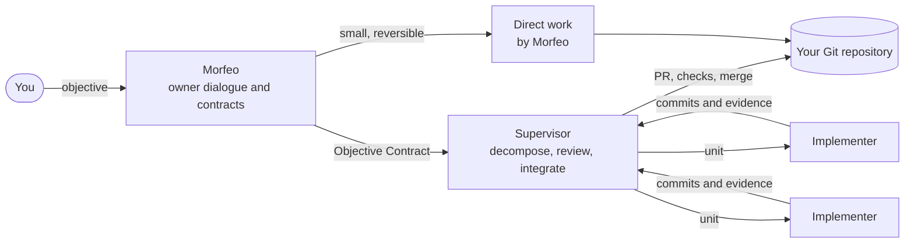

<p align="center">
  <a href="https://darkarty07.github.io/Aether-Agents/">
    
  </a>
</p>

# Aether Agents

<p align="center">
  <strong>A spec-driven software-engineering team of three AI roles, built on Hermes Agent.</strong><br>
  Describe an objective to Morfeo, agree on a durable Objective Contract, and let a Supervisor
  and parallel Implementers deliver it in isolated Git worktrees with independent review.
</p>

<p align="center">
  <a href="https://github.com/DarkArty07/Aether-Agents/releases/latest"></a>
  <a href="LICENSE"></a>
  
  <a href="https://github.com/DarkArty07/Aether-Agents/actions/workflows/policy.yml"></a>
  <a href="https://darkarty07.github.io/Aether-Agents/"></a>
</p>

<p align="center">
  <a href="https://darkarty07.github.io/Aether-Agents/"><b>Website</b></a> ·
  <a href="docs/index.md"><b>Documentation</b></a> ·
  <a href="docs/installation.md"><b>Install</b></a> ·
  <a href="docs/tutorials/first-objective.md"><b>Tutorial</b></a> ·
  <a href="CHANGELOG.md"><b>Changelog</b></a>
</p>

---

Aether Agents is a multi-agent software-engineering product and method. It uses
[Hermes Agent](https://hermes-agent.nousresearch.com/docs/) as the runtime (profiles,
boards, worktrees, review, tools) and [GitHub Spec Kit](https://github.com/github/spec-kit)
as the specification method. Aether adds what neither provides on its own: three roles
with clear authority, durable Objective Contracts, a proportional route choice, evidence
you can observe, and a managed, reversible release lifecycle.

## How it works



1. **You talk to Morfeo.** Morfeo is the only role you address. It inspects your project,
   confirms its constitution, and decides the route for the complete objective.
2. **Small, reversible work goes direct.** Morfeo does it, verifies it, and reports. No
   ceremony.
3. **Substantial work becomes a contract.** Morfeo writes a versioned Objective Contract
   (scope, authority, acceptance, stop conditions), commits it, and hands one card to the
   Supervisor.
4. **The Supervisor decomposes and reviews.** Each unit goes to an Implementer in its own
   branch and worktree. The Supervisor reviews work it did not write, integrates in
   dependency order, and closes out through a pull request with required checks.
5. **You observe instead of babysitting.** `aether observe` gives you a compact,
   deterministic brief of a contract's progress, changes and anomalies.

## Features

| Capability | What you get |
| --- | --- |
| **Three roles, one owner** | Morfeo (dialogue and contracts), Supervisor (decomposition, review, integration) and replicable Implementers. See [Roles and authority](docs/roles-and-authority.md). |
| **Objective Contracts** | Immutable, Git-committed contract versions with a verified digest and a small handoff envelope. See [Objective Contracts](docs/guides/objective-contracts.md). |
| **Proportional routes** | Direct work for bounded changes, the full pipeline for substantial ones. See [Lifecycle](docs/guides/lifecycle.md). |
| **Isolation and review** | One branch and worktree per unit, independent review, terminal GitHub closeout. See [Execution](docs/guides/execution.md). |
| **Contract Observation** | `aether observe` and the `aether_observe` tool: bounded, provider-free briefs. See [Observation](docs/guides/observation.md). |
| **Project knowledge** | Optional Graphify graph and per-role work memory shared by all three roles. See [Project knowledge](docs/guides/project-knowledge.md). |
| **Morfeo over MCP** | Use Morfeo from Claude Code or any MCP client with `aether mcp morfeo serve`. See the [Claude Code tutorial](docs/tutorials/claude-code.md). |
| **Opt-in Claude Code Implementer** | Run Implementer attempts on Claude Code for a contract, with automatic fallback to Hermes. See [Execution](docs/guides/execution.md#opt-in-implementer-harness-claude-code). |
| **Managed releases** | `aether setup`, `update` and `rollback` stage, verify and switch releases atomically while preserving your state. See [Policy and recovery](docs/guides/policy-and-recovery.md). |
| **Edge-safety policy** | A pre-tool hook guards secrets, credential acquisition, unauthorized external effects and destructive operations. Ordinary work stays free. |

## Quick start

You need Linux or WSL2 with a systemd user session, Git, [uv](https://docs.astral.sh/uv/),
Node.js 22+ with npm, `jq`, and an account with a model provider supported by Hermes. The
[installation guide](docs/installation.md) explains every step.

```bash
# 1. Download and verify the release bundle
gh release download v1.0.0 --repo DarkArty07/Aether-Agents --dir aether-1.0.0
cd aether-1.0.0 && sha256sum --check SHA256SUMS

# 2. Clone the pinned Hermes runtime source named in the release lock
git clone --branch aether-main https://github.com/DarkArty07/aether-hermes.git
git -C aether-hermes reset --hard "$(jq -r .hermes.commit aether-agents-1.0.0-release-lock.json)"

# 3. Install and activate the release (drop --yes to preview first)
uvx --python 3.11 --from ./aether_agents-1.0.0-py3-none-any.whl aether setup \
  --wheel ./aether_agents-1.0.0-py3-none-any.whl \
  --hermes-checkout ./aether-hermes \
  --release-lock ./aether-agents-1.0.0-release-lock.json --yes
aether doctor

# 4. Pick a model for each role and enable Morfeo's toolsets
#    (installation guide, step 5)

# 5. Initialize an existing Git repository and start Morfeo
cd ~/code/my-project
aether init
aether
```

Then follow [your first objective](docs/tutorials/first-objective.md).

## Documentation

| Start here | Understand | Look up |
| --- | --- | --- |
| [Installation](docs/installation.md) | [Product boundary](docs/product-boundary.md) | [CLI reference](docs/reference/cli.md) |
| [Getting started](docs/getting-started.md) | [Roles and authority](docs/roles-and-authority.md) | [Plugins and tools](docs/reference/plugins-and-tools.md) |
| [Tutorial: first objective](docs/tutorials/first-objective.md) | [Lifecycle](docs/guides/lifecycle.md) and [Execution](docs/guides/execution.md) | [Capability coverage](docs/reference/capabilities.md) |
| [Tutorial: Claude Code](docs/tutorials/claude-code.md) | [Objective Contracts](docs/guides/objective-contracts.md) | [Limitations and troubleshooting](docs/reference/limitations-and-troubleshooting.md) |
| [Tutorial: project knowledge](docs/tutorials/project-knowledge.md) | [Expected agent behavior](docs/guides/expected-behavior.md) | [Authority map](docs/authority.md) |

The full [documentation index](docs/index.md) is also published, with search, on the
[website](https://darkarty07.github.io/Aether-Agents/docs/). The documentation describes
the behavior of this build; [`docs/capabilities.toml`](docs/capabilities.toml) is the
sole current implementation-status and traceability registry.

## Project status

**Aether 1.0.0 is the final feature set.** The maintainer has frozen features at this
release, and the project is published as-is ([release record](specs/v1-stable-release/spec.md)).
Bug reports and pull requests are welcome, but fixes are not guaranteed.

Known limits you should expect:

- Installation uses the release bundle with `aether setup`. There is no PyPI package,
  hosted installer or automatic update channel.
- `aether start`, `stop`, `restart` and `status` remain explicit unsupported placeholders,
  and `aether reconcile` supports only its bounded `--to active` form.
- `aether uninstall --export` is not implemented.
- The Aether Telegram Monitor and its periodic progress reports were retired before 1.0
  without a replacement. Hermes-native cron, ordinary Telegram interaction and Hermes'
  native task/final/input notifications remain unchanged.
- Agent behavior depends on the models you configure. Aether has not been qualified with
  provider-backed live campaigns or on WSL2 as a platform.
- Open defects are listed in [known issues](docs/reference/limitations-and-troubleshooting.md#known-issues).

## Built on

- [Hermes Agent](https://hermes-agent.nousresearch.com/docs/) — the agent runtime, run from
  the maintained fork [`DarkArty07/aether-hermes`](https://github.com/DarkArty07/aether-hermes)
  pinned by commit in every release lock.
- [GitHub Spec Kit](https://github.com/github/spec-kit) — the specification method Aether
  adapts for an absent owner.
- [Graphify](https://github.com/Graphify-Labs/graphify) — the optional project-knowledge graph.

## Contributing

Read [CONTRIBUTING.md](CONTRIBUTING.md) and the repository rules in [AGENTS.md](AGENTS.md).
Maintainer authorities: [`DESIGN.md`](DESIGN.md) owns accepted design decisions,
[`specs/`](specs) owns normative intent, [`ROADMAP.md`](ROADMAP.md) records phase history
and [`CHANGELOG.md`](CHANGELOG.md) records release deltas. Report security issues as
described in [SECURITY.md](SECURITY.md).

## License

MIT — see [LICENSE](LICENSE). Created by [Christopher Hernández Jiménez (@DarkArty07)](https://github.com/DarkArty07).
