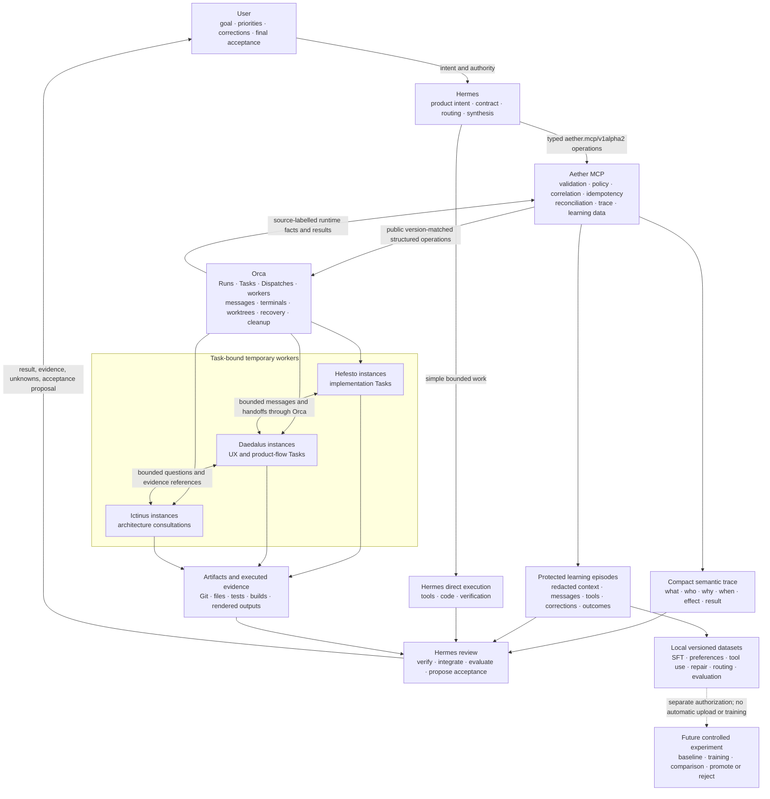

# Aether MCP Control and Trace Plane

> **Status:** ADAPTIVE SCHEMAS/RESTRICTED FOUNDATION IMPLEMENTED; PROVIDER ORCHESTRATION BLOCKED; NOT ACTIVATED
> **Date:** 2026-08-08
> **Authority:** ADR-0001, PDR-0012, and PDR-0013
> **Protocol target:** `aether.mcp/v1alpha2`
> **Closed implementation scope:** bounded R0-R6 default-off redesign and qualification

## 1. Purpose

Aether MCP is the single product-owned interface through which the primary
Hermes supervises an Orca-backed swarm. It provides:

- a compact typed control surface;
- deterministic contract and authority validation;
- version-matched Orca operation translation;
- durable correlation across product and runtime identities;
- append-only trace of what, who, why, when, effect, result, and evidence;
- a future separate default-off learning boundary for secret-redacted episodes,
  labels, datasets, and local export;
- privacy-safe query, explanation, and measurement projections.

The MCP exists because direct CLI control cannot by itself provide one stable
Aether semantic and measurement boundary. It does not replace Orca or revive the
retired Olympus architecture.

## 2. Goals

1. Give Hermes one stable MCP namespace for normal swarm supervision.
2. Cover all admitted Orca orchestration capabilities without one tool per Orca
   command.
3. Require a traceable rationale and authority reference for consequential
   actions.
4. Preserve exact project, contract, run, task, attempt, worker, terminal, and
   worktree correlation.
5. Keep Orca authoritative for operational state.
6. Preserve unknown outcomes and reconcile before retry.
7. Preserve a later separately gated learning boundary for controlled evaluation,
   prompt/policy/skill refinement, routing and future fine-tuning.
8. Keep the user-facing product experience in Hermes rather than Orca CLI.

## 3. Non-goals

Aether MCP is not:

- a semantic planner or autonomous coordinator model;
- a Run/Task/Dispatch scheduler independent from Orca;
- a worker process manager outside Orca;
- a second message bus or recovery engine;
- a replacement for Git, tests, builds, browsers, emulators, or evidence tools;
- a continuity/user-memory replacement for Hermes Agent;
- an ungoverned transcript dump, a store for credentials/hidden chain-of-thought,
  or a duplicate of unbounded terminal/provider logs;
- an automatic dataset judge, trainer, fine-tuning service, or model promoter;
- a release, deployment, credential, spending, or product-acceptance authority;
- an HTTP/LAN service in its first accepted form;
- a compatibility shim for Olympus, Harmonia, ACPManager, or `talk_to`.

## 4. Target topology



The diagram represents the target architecture, not the current runtime. Hermes
remains the product brain and may work directly when a swarm would add no value.
Aether MCP validates and records semantic intent but does not execute or own a
second scheduler. Orca owns operational mechanics, and workers remain temporary
and Task-bound. Rich learning data can produce local dataset candidates, but
training and promotion remain separately authorized future experiments.

The initial MCP transport is local stdio. The exact Hermes profile launches the
server with an allowlisted environment. MCP server sampling is disabled.

Each Hermes session may launch its own stdio child. Processes sharing one
`AETHER_HOME` coordinate through the same project-partitioned transactional
store: project event sequence and operation idempotency are assigned under a
single database write transaction with uniqueness constraints and a bounded lock
wait. If the operation request cannot be durably appended, the server returns
`TRACE_STORE_BUSY` and performs no Orca mutation. A provider effect after a
durable request but before terminal receipt remains an explicit reconciliation
case after crash/restart.

## 5. Authority and source-of-truth matrix

| Fact or decision | Authority | MCP behavior |
|---|---|---|
| Product goal, visible behavior, material compromise | User | Reference; never invent or amend |
| Contract, non-goals, acceptance, stop condition | Hermes under user authority | Validate and trace versions |
| Direct-versus-swarm choice | Hermes | Record concise rationale |
| Participant admission and Task DAG | Hermes/Aether policy | Validate deterministically, then materialize through Orca |
| Run, Task, dependency, Dispatch state | Orca | Query, correlate, and label source/freshness |
| Worker, terminal, worktree, message, recovery state | Orca | Query and never mirror as independent truth |
| Declared rationale, authorization, semantic decision | Aether trace | Append-only authority |
| Code and artifact bytes | Git/filesystem | Store canonical refs/digests; admitted learning episodes may preserve bounded diffs/content for replay |
| Test/build/E2E outcome | Executed evidence | Store bounded receipts and coverage |
| Technical review | Hermes/Verifier within contract | Trace as evidence, not product acceptance |
| Semantic completion proposal | Hermes | Record separately from operational completion |
| Final product acceptance | User | Record explicit decision and referenced contract |
| Release/activation/protected effect | Separate owner/gate | Deny or require exact authorization |

A projection may combine these sources for display, but every field names its
source and freshness. `UNKNOWN` is a valid state.

## 6. Logical components

### 6.1 MCP tool boundary

Registers one server namespace, expected to appear to Hermes as
`mcp__aether__*`. It validates protocol version, principal, project binding,
input schema, effect class, and output envelope.

The exact operational set is the 15-tool successor defined in
`../reference/AETHER_MCP_CONTRACT.md`. Decision/evidence append are typed
`swarm_trace` actions; batching and eventual observation are internal; learning
and project forget are separate future boundaries. No tool is currently
registered or callable.

The server also exposes project-bound read-only MCP resources for protocol,
validated contract generation, Run summary/timeline, and closeout. Resources
carry source/freshness and obey the same redaction/non-enumeration policy as
tools. MCP roots are containment hints only, never project authority. The server
exposes no MCP prompts, does not request sampling, and does not depend on
server-initiated notifications for correctness.

### 6.2 Coordinator principal

The first accepted version serves only the primary Hermes coordinator. The
principal is derived from the exact launched profile/session, not accepted as a
free request field.

The coordinator principal may perform admitted high-level operations and
low-level dynamic Orca calls. Availability does not grant authority: each
mutation is still checked against project, contract, participant, effect, and
user policy.

### 6.3 Project admission and identity registry

Before any swarm contract, Hermes calls `project_admit` for one exact canonical
project root. The MCP resolves and records an immutable project ID plus:

- canonical root and Git common-repository identity;
- current worktree and branch/commit evidence;
- exact Aether/Hermes home and coordinator profile binding;
- safe project alias and allowed sibling worktree relationship;
- admission generation and source timestamps.

The server generates `project_id`; callers cannot choose an ID to impersonate
another project. A moved root requires an explicit rebind event and fresh
identity evidence. The restricted local registry may retain the exact absolute
root because operation containment requires it; ordinary trace events and
exports use `project_id` and a safe alias unless the requester is authorized for
the restricted field.

`project_inspect` performs a fresh read of the binding and current repository
identity before planning or mutation. Project admission moves or edits no
project files.

### 6.4 Contract and manifest validator

Validates a `SwarmManifest` before any mutation:

- immutable project and contract identity;
- objective, acceptance, non-goals, authorized effects, and stop condition;
- current participant-policy snapshot;
- one deliverable and owner per Task;
- dependency acyclicity and readiness;
- one writer per mutable scope/worktree;
- no overlapping write scopes unless explicitly serialized;
- profile/runtime availability;
- evidence and budget requirements;
- use-case binding when evaluation mode is enabled.
- learning capture policy, purpose, consent authority, quota and encryption
  prerequisite.

Validation returns a canonical manifest digest and an effect plan. It does not
create Orca state.

At `swarm_start`, the privacy-filtered canonical manifest is recorded as an
immutable contract-generation snapshot before the first Orca effect. Its compact
semantic event does not contain the raw user prompt; an admitted `FULL_EPISODE`
store may preserve the secret-redacted model-visible prompt by content reference.
A later amendment creates a new generation; it does not rewrite the snapshot or
episode used by an earlier operation.

### 6.5 Orca provider catalog and adapter

The provider adapter resolves exactly one admitted Orca executable/build for a
Run, loads its version-matched public guide and machine-readable operation
catalog, and builds argv arrays or official API calls from validated structured
arguments.

It never accepts a free-form command string. It requires structured JSON
responses and maps provider errors into stable Aether error classes without
claiming unsupported semantics.

The accepted M0 provider-seam fast path permits a version-pinned Aether schema
bundle when the public Orca catalog names commands and arguments but omits
result, effect, timeout or recovery schemas. Such a bundle is derived only from
separately authorized isolated public-command fixtures, pins their exact evidence
digests and fails closed on material drift. It does not convert an observation
into provider authority or admit undocumented/private state.

An aggregate capability absent from the public catalog may be composed only from
described public Orca operations under one explicit idempotency, partial-result,
reconciliation and cleanup plan. Aether owns the adapter plan and receipts; Orca
continues to own every operational resource and lifecycle effect. Canonical
authority: `docs/releases/v0.22.0/M0_PROVIDER_SEAM_AMENDMENT.md`.

Every Run pins:

- provider type;
- executable/artifact identity;
- version and digest;
- operation catalog/schema digest;
- Aether-owned qualified schema-bundle digest when the provider catalog is
  incomplete;
- adapter version;
- supported capability set.

A material schema mismatch blocks mutation. Read-only diagnosis may continue
when it can report the mismatch honestly.

Dynamic `orca_call` operations pass through the same principal, project,
contract, participant, effect, idempotency, version, privacy, and trace checks as
high-level tools. Internal independent batching retains one result per member.
Neither path can bypass product invariants.

### 6.6 Operation journal and idempotency

Every mutation has a caller-supplied `operation_id`. The MCP appends
`operation_requested` before provider invocation and a terminal receipt after
observation:

- `SUCCEEDED`;
- `REJECTED`;
- `FAILED`;
- `PARTIAL`;
- `CANCELLED`;
- `UNKNOWN`.

Repeating the same `operation_id` with the same canonical request returns the
stored terminal receipt or current reconciliation state without repeating the
effect. The replay receives a fresh server `request_id` but preserves stable
terminal result/effect fields. Reusing the operation ID with different input is
rejected.

A timeout after possible delivery is `UNKNOWN`, not a retry signal. The MCP
queries Orca, Git/filesystem, processes, and prior receipts as applicable before
allowing a new attempt.

Each non-read operation records a normal provider budget, `reconcile_after_utc`,
and a longer `lease_deadline_utc`. Expiry never fabricates terminality; it changes
the journal projection to `RECONCILIATION_REQUIRED` and requires
`swarm_reconcile`. `observe` may append a terminal receipt only from exact fresh
evidence. `fence` requires its own operation ID, reason, authority, described
provider effect, and post-effect verification.

On startup, the server discovers every `operation_requested` without a terminal
receipt. Mutations affecting the same project/resource scope remain blocked
until those operations are reconciled; read-only diagnosis remains available.

### 6.7 Semantic trace store

The trace store is append-only for product events. It records semantic facts and
minimal correlations that Orca does not own. It does not maintain a second
operational state machine.

The proposed local storage boundary is project-partitioned under
`$AETHER_HOME/state/aether-mcp/`. An immutable project identifier binds the
canonical project plus its worktrees; it is not derived solely from the current
path. Exact file layout and migration commands remain implementation-plan
choices.

The first implementation target is a local SQLite store with:

- restrictive file permissions;
- WAL and transactional append;
- schema migrations serialized by one startup lock covering the full migration;
- failed/startup-lock cleanup that prevents a partially ready writer;
- per-project partitioning or equally strong isolation;
- storage-level referential integrity for project/Run/Task/Dispatch/operation
  relationships so foreign child IDs cannot be cross-bound;
- monotonic per-project event sequence;
- transactional multi-process writer serialization and unique idempotency keys;
- hash-linked events;
- closeout manifest digest.

A hash chain detects accidental/restricted-history alteration but is not claimed
to resist an attacker who can rewrite the database and every external digest.
Run closeout may export a bounded signed-or-hashed evidence manifest for stronger
independent comparison.

### 6.8 Protected learning episode and dataset store

The semantic event store is an index, not the learning corpus. Under an admitted
`FULL_EPISODE` policy, a separate encrypted project partition preserves the
secret-redacted content that participants actually saw or produced:

- system/developer/profile/SOUL/skill/memory/project/user context;
- assistant and worker responses;
- model-visible tool schemas, calls, results and errors;
- MCP and material Orca messages/handoffs;
- artifact diffs/content references, tests, reviews and corrections;
- provider/model/usage/timing facts and final outcome labels.

Content bodies are project-scoped and content-addressed. Events reference them by
ID/digest. No content deduplication crosses project boundaries. Capture gaps,
redactions, unavailable bodies and incomplete telemetry remain explicit.

Sealed episodes are immutable. Labels, redaction revisions, eligibility,
retractions and dataset membership append new versioned records. Local dataset
candidates freeze selection, transform, consent, redaction, contamination and
lineage-isolated split rules. Dataset export is local-only and separately
authorized; capture never uploads, trains, changes prompts/models/routes or
promotes a candidate.

The exact schema and curation boundary are in
`../reference/AETHER_LEARNING_EPISODE_SCHEMA.md`.

### 6.9 Correlation registry

Correlates without conflating:

```text
Aether:
project / contract generation / use case / run / task / operation / evidence

Orca:
build / run / task / dispatch / worker / terminal / worktree / message

Repository:
git common repository / canonical root / worker root / base commit / current commit
```

A worker path alone is not project identity. Sibling worktrees share one
admitted project while retaining exact filesystem containment and lineage.

### 6.10 Projection, explanation, and learning engine

Builds source-labelled views from the trace plus fresh Orca reads:

- product-owner summary;
- Task DAG and participant view;
- timeline;
- “why was this worker/operation selected?” explanation;
- evidence and unknowns;
- retries and lineage;
- resource/cleanup reconciliation;
- evaluation metrics and coverage.
- episode completeness, redaction, labels, learning eligibility and dataset
  lineage.

It is deterministic. It does not call an LLM or infer missing rationale.

## 7. Control flows

### 7.1 Validate and start

```text
Hermes binds and freshly inspects one project
  -> project_admit / project_inspect
  -> Hermes creates SwarmManifest
  -> swarm_validate
  -> policy/schema/DAG/scope validation
  -> manifest digest + effect plan
  -> Hermes resolves any material decision
  -> swarm_start(manifest_digest, operation_id, reason)
  -> initialize admitted learning episode/capture policy
  -> append operation_requested
  -> create/bind Orca Run and Tasks
  -> start all ready independent Dispatches
  -> append per-effect receipts
  -> return after dispatch acceptance, not worker completion
```

`swarm_start` is a bounded saga, not a fictitious all-or-nothing transaction.
Partial creation is returned as `PARTIAL` with exact created/rejected/unknown
effects and a required reconciliation action. It never hides partial state with
an unverified rollback.

Before the first provider mutation, `swarm_start` persists the redacted canonical
manifest generation and digest as Aether semantic authority. If provider start
then fails, the failed contract/operation history remains visible.

### 7.2 Status and supervision

`swarm_status` is zero-wait by default. It returns:

- fresh Orca operational snapshot and provider timestamp;
- Aether semantic phase and contract generation;
- changes since a cursor;
- ready, active, review-pending, blocked, cancelled, failed, and unknown Tasks;
- material questions requiring Hermes/user input;
- evidence and cleanup gaps;
- source/freshness per field.

A bounded wait is explicit. No-message means no new message, not failure.
Ordinary polling is measured through counters and latency facts rather than
flooding the semantic event timeline.

### 7.3 Dispatch after dependencies

Hermes calls `swarm_dispatch` for Tasks that the fresh snapshot shows ready. The
MCP revalidates dependency state, contract generation, participant policy,
profile availability, worktree placement, write scope, concurrency budget, and
operation idempotency immediately before invoking Orca.

### 7.4 Communication

`swarm_message` supports bounded kinds such as progress, artifact reference,
dependency handoff, technical question, reply, review request, finding, blocker,
and completion reference.

Orca owns the operational message lifecycle. Aether's compact trace stores
routing identity, kind, receipt, safe summary/content digest, decision requirement
and blocking effect. Under `FULL_EPISODE`, the protected content store also
preserves the full secret-redacted model-visible message for learning and replay.

Free text cannot grant authority. Product-material questions return to Hermes.

### 7.5 Reconciliation, retry, and cancellation

`swarm_reconcile` handles incomplete or ambiguous operations explicitly. It
queries fresh Orca state/events and applicable Git/filesystem/process receipts,
correlates exact identities, and either proves a terminal outcome, preserves
`UNKNOWN` with missing evidence, or applies one separately authorized fencing
operation. A lease deadline is a reconciliation trigger, never automatic retry
permission.

A retry requires:

- classified prior outcome;
- old Dispatch identity;
- evidence that the old attempt is terminal or fenced;
- new operation and Dispatch identity;
- remaining budget;
- reason and expected correction.

Cancellation acknowledges only the requested scope. Aggregate cleanup and
unknown resource reconciliation remain separate.

### 7.6 Evidence and semantic decisions

`swarm_trace(action=record_evidence)` records bounded evidence references, digest,
executed command/tool identity, outcome, coverage, and unknowns. It does not turn
test success into acceptance.

`swarm_trace(action=record_decision)` records contract amendments, participant
changes, user answers, waivers, semantic acceptance/rejection, and later-horizon
gates with explicit authority.

### 7.7 Learning capture, labels, and curation

This section preserves the separately gated learning-boundary design. None of its
conceptual operations belongs to or is callable through the 15-tool operational
MCP.

Before the first model/provider effect, the admitted capture policy initializes
an episode envelope. Every participant turn and model-visible tool exchange is
captured with fidelity, redaction, source and coverage classifications. A pause,
quota failure or unavailable hook creates an explicit gap.

Hermes may append evidence-backed outcome, correction, preference, failure,
quality and eligibility labels. Worker self-report cannot certify training
quality. On closeout the episode is integrity-checked and sealed or remains
incomplete/quarantined.

Later local curation may derive SFT, preference, tool-policy, repair, routing or
evaluation datasets from sealed episodes. Evaluation-only lineages never enter
training splits. Export remains a separate local artifact action; training,
provider upload and promotion are outside this MCP version and require later
owner gates.

### 7.8 Close

```text
Hermes requests swarm_close
  -> freeze new dispatches
  -> reconcile every Task/Dispatch
  -> verify required evidence disposition
  -> request Orca cleanup
  -> inspect workers, terminals, worktrees, messages, questions, branches,
     sockets, processes, and temporary state
  -> append closure receipt
  -> return CLOSED only with zero unknowns or authorized retained resources
```

`BLOCKED` or `UNKNOWN` closure remains open. Stopping one worker is not aggregate
cleanup.

Cleanup mutation is limited to resources whose creation/admission receipts bind
them to this Run. A similarly named pre-existing branch, worktree, terminal,
process, or file is not removable merely because it appears near the project.

## 8. Semantic and operational states

The MCP keeps state families separate.

### Aether semantic phase

- `CONTRACT_DRAFT`;
- `CONTRACT_VALIDATED`;
- `OPERATIONAL_ACTIVE`;
- `REVIEW_PENDING`;
- `ACCEPTANCE_PENDING`;
- `SEMANTICALLY_ACCEPTED`;
- `SEMANTICALLY_REJECTED`;
- `CLOSING`;
- `CLOSED`;
- `BLOCKED`.

These are product/trace projections from explicit events, not copies of Orca
Task status.

### Orca operational status

Kept as versioned provider values plus a conservative normalized class. Unknown
provider values remain visible and block unsafe mutation.

### Evidence status

- `NOT_REQUESTED`;
- `PENDING`;
- `OBSERVED`;
- `VERIFIED`;
- `FAILED`;
- `INSUFFICIENT`;
- `UNKNOWN`.

### Acceptance status

Operational completion, evidence verification, Hermes completion proposal, and
user acceptance are distinct events.

## 9. Learning-data privacy and disclosure

Never persist in any layer:

- hidden chain-of-thought or inaccessible model internals;
- API/OAuth tokens, cookies, headers, credential paths, `.env` contents;
- raw provider/account identifiers when a safe alias is sufficient;
- unrelated user/session/project data;
- raw errors or tracebacks containing paths or submitted content.

The semantic trace persists normalized facts, safe aliases, bounded reasons,
receipts, digests and references. The protected episode layer may persist full
secret-redacted model-visible prompts, messages, assistant responses, tool
arguments/results, bounded terminal excerpts and admitted artifact content when
the project/Run policy is `FULL_EPISODE`. Every export reapplies redaction,
consent, sensitivity, lineage and contamination checks. Missing telemetry is
`null`/`UNKNOWN`, never inferred.

Normalized semantic data has no silent expiry. Future learning retention,
prune/revoke/export, and owner-only project forget remain design contracts for
separate default-off boundaries; they are not exposed by the operational MCP.
Credentials and hidden chain-of-thought are never stored. Explicit bounded
redacted diagnostic attachments are disabled by default and expire within seven
days. Exact classes and future tombstone limits are in
`../reference/AETHER_TRACE_SCHEMA.md`.

Historical `.aether` databases are not imported automatically.

## 10. Security boundaries

- Local stdio only in the first accepted version.
- No arbitrary shell strings.
- Environment allowlist; no ambient credential inheritance.
- Exact coordinator principal and project binding.
- Participant-policy enforcement at every dispatch/retry.
- Effect classes: `READ_ONLY`, `LOCAL_APPEND_ONLY`, `LOCAL_REVERSIBLE`,
  `LOCAL_DESTRUCTIVE`, `EXTERNAL_REVERSIBLE`, `EXTERNAL_IRREVERSIBLE`, `UNKNOWN`.
- Protected and unknown effects require separate authority or are denied.
- Foreign/nonexistent project identities use non-enumerating safe failures.
- Workers never receive coordinator tools.
- Sampling disabled.
- Every mutation is idempotent and trace-linked.
- Schema drift fails closed.
- No hidden fallback to retired Aether/Olympus paths.

## 11. Compatibility and evolution

The Aether MCP protocol is versioned independently from Orca and Aether product
SemVer. Historical `aether.mcp/v1alpha1` bytes remain preserved; the redesigned
15-tool successor is `aether.mcp/v1alpha2` until executed compatibility and
migration evidence justify a stable `v1`.

Compatibility rules:

- additive optional response fields may appear within `v1alpha1` only when
  unknown-field handling is verified;
- required field or semantic changes require a protocol revision;
- each provider adapter advertises exact supported Orca builds/capabilities;
- a Run never changes provider schema silently;
- old trace events remain readable through explicit migrations;
- unsupported capabilities produce `CAPABILITY_UNAVAILABLE`, not an invented
  fallback.

## 12. Learning and measurement readiness

Every evaluation Run binds immutably to a versioned use-case specification and
variant. The compact trace records normalized metrics while the rich episode
preserves the qualitative and trajectory data needed to understand and improve:

- scope fidelity and acceptance coverage;
- time to first useful result and total duration;
- actual parallel overlap;
- participants, Tasks, Dispatches, retries, cancellations, and corrections;
- user interruptions and decision count;
- coordination messages and waits;
- defects detected before and after integration;
- evidence quality and unknowns;
- tokens, reported/estimated cost, and coverage when authoritative data exists;
- cleanup duration, survivors, and unknown resources;
- final user acceptance, rejection, or redirection.
- exact secret-redacted context/response/tool trajectories;
- user corrections and corrected targets;
- selected/rejected alternatives and label authority;
- episode completeness, redaction, quarantine and dataset eligibility;
- dataset lineage, split isolation and benchmark contamination.

The metric contract is in
`../releases/v0.22.0/MEASUREMENT_CONTRACT.md`. The final proposed deterministic,
controlled-comparison, and product-topology cases are in
`../releases/v0.22.0/USE_CASE_CATALOG.md`.

## 13. Required negative-design matrix

Implementation planning must include deterministic tests for:

- forged/missing coordinator principal;
- foreign or moved project root without admitted binding;
- wrong worktree/repository lineage;
- disabled, forbidden, retired, or unavailable participant;
- cyclic dependencies and overlapping writers;
- stale contract generation or Dispatch;
- duplicate `operation_id` with same and different payload;
- timeout after possible provider delivery;
- partial batch/start saga;
- provider schema/version drift;
- unknown provider state/effect;
- MCP crash between request and receipt;
- restart with incomplete reconciliation;
- retry before old-attempt fencing;
- secret disclosure, missing allowed episode content, capture-policy escalation,
  and false completeness;
- unauthorized episode access, cross-project content deduplication, invalid label
  authority, dataset contamination, lineage break, revoked-data export and
  external training/upload attempt;
- cross-project trace query;
- closure with one unknown or surviving resource;
- event sequence/hash mismatch;
- missing measurement fields represented honestly as unknown.

## 14. Current truth and final acceptance gate

### Established

- The product owner approved MCP-first rather than CLI-first control.
- Aether MCP must provide condensed Orca access and learning data rich enough to
  improve and refine the system; auditability is secondary.
- Orca remains operational authority.
- Hermes remains product supervisor and final synthesizer.
- The accepted design includes tool/error/effect contracts, project
  admission, semantic trace, protected learning episodes/datasets,
  retention/deletion/lineage, privacy/integrity, closeout, deterministic failure
  cases, and concrete measurable use cases/thresholds.

### Implemented through M2

- The package and zero-tool stdio bootstrap exist; R2 implements the exact
  15-schema `v1alpha2` successor while preserving historical `v1alpha1` bytes.
- M2.3-M2.6 implement trusted project admission, SQLite WAL operation receipts and
  semantic decisions/evidence, fail-closed AES-256-GCM protected content,
  deterministic manifest/DAG validation and a version-pinned read-only Orca
  catalog. No production key provider is enabled.
- Two independent fresh desktop-renderer profiles qualified public-CLI coordinator
  admission, Run/Task recovery across restart, explicit generation-2 rebind,
  completion and reset for Orca 1.4.167. Headless `serve` admission remains absent.
- No operational MCP tool is registered/callable. No Aether lifecycle Run, worker,
  model, credential, provider spend, registration or activation was introduced.

### Still not implemented or authorized

- M3 lifecycle control and every M4+ worker/swarm capability.
- A production key-custody provider or full-episode capture activation.
- Model-backed workers, Release, registration, deployment and activation.

### Final disposition

Christopher accepted the adaptive direction and R0-R6 task on 2026-08-08, then
authorized completion through M2 with a strict stop before M3 on 2026-08-09. The
exact desktop-backed coordinator binding is technically qualified with its
headless limitation recorded. M2 is complete and default-off; M3 requires a new
owner gate and this milestone does not grant registration or activation.
